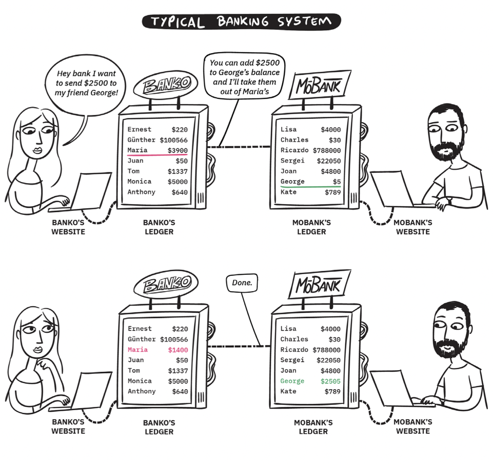
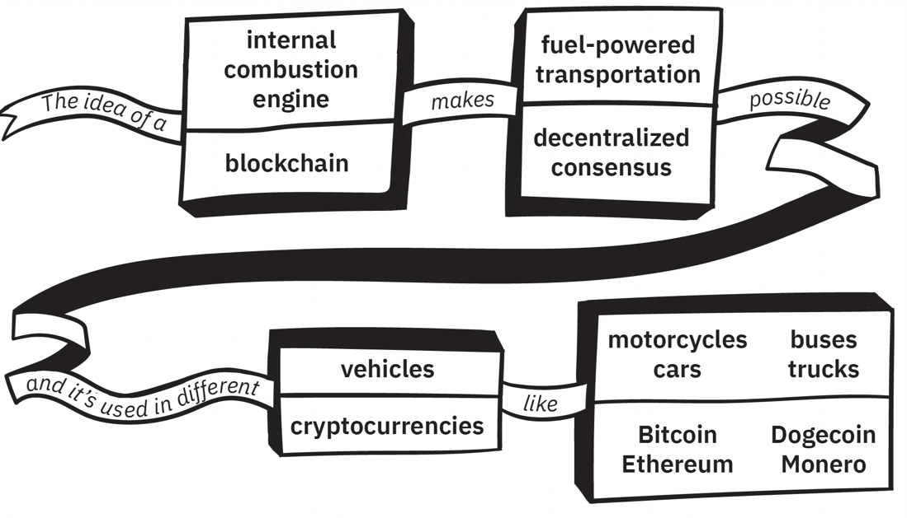
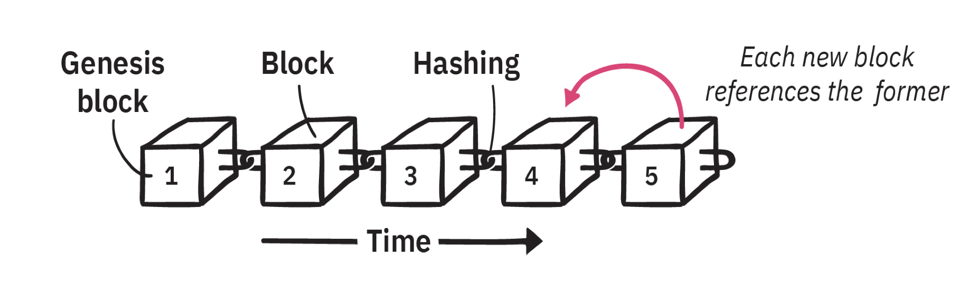
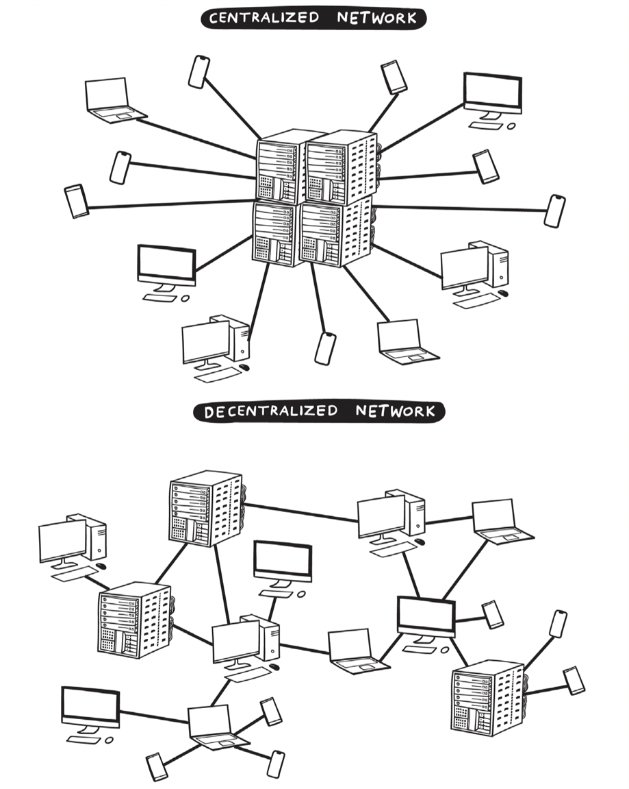
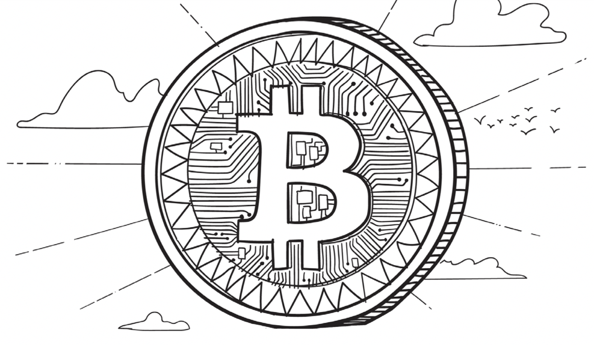
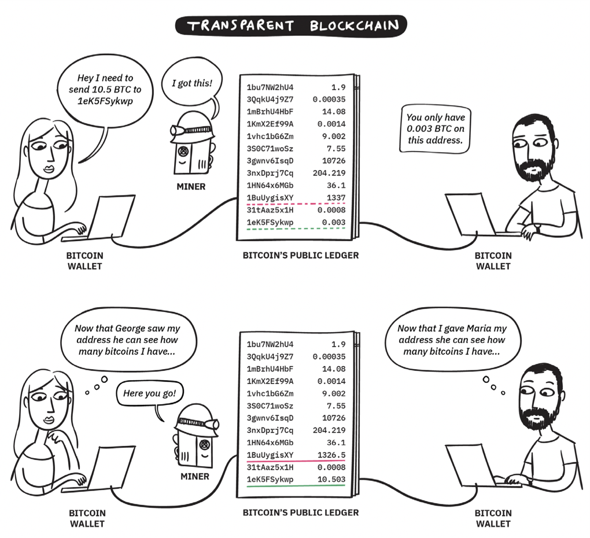
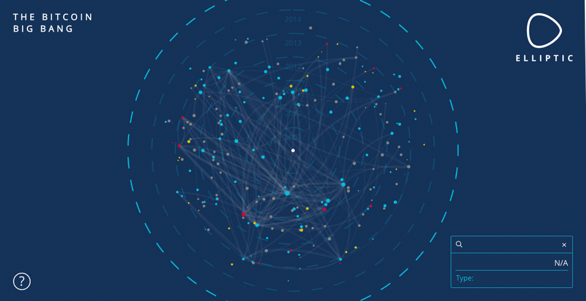
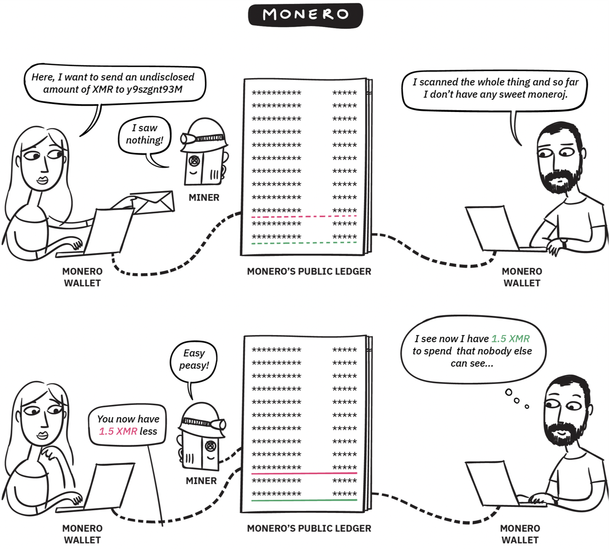

# 1 密码学货币和Monero简介  

Maria要从George那里购买小汽车，在本章中，我们将考虑她可以付款的三种不同方式：传统银行，透明密码学货币（例如，比特币）和Monero。

## 1.1 银行支付 

图1.1- Maria通过传统银行系统向George汇款。

如果Maria通过传统的银行系统将钱汇给George，他们会信任两个中间方（各自的银行）象征性地为他们转移资金。

这里没有实物票据或资产实际变动；两家银行都只需修改自的数据库以显示资金已经转移。当Maria向银行提交交易时（无论是通过电汇，银行网站还是应用程序），银行从其账本上的账户余额中减去2500美元，然后与George的银行联系并要求他们在George的余额中增加2500美元。

该系统存在一些弊端和风险，而且要对银行的完全信任。Maria，George和银行必须坚信交易是合法的，并且账本是真实的。这种信任中间第三方带来了风险，因为一个恶意的参与者或银行可以通过欺诈性地修改账本余额或交易数据数据库来“创造”钱。

此外，Maria实际上没有3900美元的财产，只有一张银行的欠条，她必须信任它是可兑现的。她没有办法审计银行以核实他们是否确实有3900美元。

实际上，银行可能没有那么多的持有量，因为大多数银行依法按部分准备金运营——这意味着允许其实际资产大大少于承诺给账户所有者的总余额。

根据资金的发送方式，可能需要几分钟到几天的时间才能在George的银行账户中显示这2500美元。由于George不了解银行的账本或通讯方式，因此整个过程是不透明的，且无法进行监控。

许多没有亲身经历过经济动荡的人想当然认为银行会正常运转和欠条是有效的。很少有人会考虑将毕生积蓄交给不透明的公司所带来的令人不安的后果，往往把所有的钱都放在一个单一的机构里。可能由于以下原因发生损失：

• 过失（银行犯错）

• 财务问题（银行超支资产或倒闭）

• 恶意和腐败（银行或恶意员工窃取您的钱）

• 敌对的第三方（银行被抢劫或黑客窃取电子资金）

值得庆幸的是，新兴的区块链技术能够通过创建一个分布式账本来减轻所有上述风险，所有参与方都可以平等地使用，查看和验证账本。陌生人就共享文件达成一致的非凡能力被称为分布式共识，在过去十年中已经发生了革命性的变化。

首先，您很容易对术语感到困惑，特别是当大多数人同时被介绍了几个术语时。您可以将“区块链”视为一种允许网络建立“去中心化共识”协议的技术。通过使陌生人安全地共享账本，可以构建具备数字现金功能的“密码学货币”。全球有多种常规货币（欧元，美元，日元等）；类似地，各个团队构建了许多不同的密码学货币（Monero，以太坊，比特币等）。

图1.2-这个类比显示了各种密码学货币术语（区块链，去中心化共识和密码学货币）和与常见交通相关的词语之间的相似之处。

## 1.2 区块链简介

任何人都可以了解Monero及有关其区块链工作机制的方方面面，而无需知道底层的数学和密码学（类似于任何人在不先研究DNS服务器和IPv6协议的情况下就能精通互联网）。本章重点介绍关键概念和词汇，而不会深入探讨所有技术细节-如果您想深入了解密码框架，则可以跳至第4章和第5章。

### 1.2.1 区块链是什么?

“区块链”一词是指一种用于保护数据库中所有网络用户共享记录的特定方法。对于一个不可信任的系统而言，这是开创性的，该系统中的个人对资金拥有完全的自主权，没有中央机构，每个参与者都可以轻松地验证和审核系统。

图1.3-每隔几分钟，网络就会在链上添加另一个永久性信息区块，通过其哈希值安全地链接到前一个区块。

欢迎全世界任何人担任网络维护者，每个参与者都通过验证区块链来使其他人保持诚实。当用户广播要放置在区块链上的信息时，网络维护人员将这些传输信息分组成区块，并使用密码方法最终确定记录并将它们永久链接到区块链上。

图1.4-在传统的集中式网络（上面）中，所有用户都必须连接到由第三方维护的指定机器，如服务器机架的中央集线器所示。 在一个分布式的网络（下面）中，用户创建了一个互连机器的临时网络。 Monero使用后一种类型的系统，而没有特殊的集中式服务器，而是采用志愿者节点的弹性对等网络，彼此共享新信息。

一旦数据被密封到区块链上，就不能以任何方式删除，移动或更改。这些记录不可篡改的，网络上的每个参与者都有相一致的区块链副本以供自己验证。大多数密码学货币区块链采用精巧的挖矿模型，该模型鼓励参与网络并保持所有记录的真实性和同步性。由于没有单个服务器或中央数据库可以受到恶意攻击或操纵，因此这类分布式系统非常健壮。

这些分布式系统也是不可信任的，因为网络中的每个参与者都维护并验证自己的记录副本，而不是依赖于任何第三方。鉴于区块链提供了用于全球防篡改记录保存的系统，因此它们非常适合存储财务数据。实际上，第一个现代的分布式区块链于2008年作为比特币密码学货币的底层机制首次亮相。

2008年10月31日，一个名叫Satoshi Nakamoto的匿名个人或团体发布了一份白皮书 “比特币：一种点对点电子现金系统”。这份改变世界的文件为开源分布式密码学货币奠定了框架，并使之成为革命性区块链技术。

在第一部分中的图1.1突出显示了通过传统银行系统汇款需要多次交易，单独的分类账本以及对多个银行的信任过程。图1.5显示了Maria如何将10.5枚比特币从其地址（1BuUygisXY）转移到George控制的地址（1eK5FSywkp）上的汇款的方法。为了方便起见，本示例参考了比特币（BTC），但是几乎所有密码学货币都使用这种类型的公共账本，因此会遇到以下益处和问题。

图1.5-Maria使用透明公共区块链的加密货币（例如比特币）向George汇款。

### 1.2.2 区块链优势  

区块链优势是显而易见：

• 简单性（& 速度）：Maria的钱只需一步就可以广播给George，接着更新一个账本。银行和电汇可能需要几天或几周的时间，而密码学货币账本通常会在几秒钟或几分钟内更新（交易确认时间因不同的密码学货币而异）。

• 没有第三方风险：Maria和George依靠自己的密码保护和自我维护系统，而不是将金钱和信任放在第三方手中。

• 假名：与银行不同，密码学货币账本从不在账本中记录“ Maria”和“ George”之类的真实姓名。实际上，生成密码学货币钱包永远不需要个人信息。George将以假名访问这些资金，用他的密钥访问Maria广播钱的1eK5FSywkp地址（钱来自她的账户1BuUygisXY）。

比特币和随后的其他密码学货币引发了一场仍在不断发展的金融革命。借助这些新的分布式网络，任何人都可以自行决定存储和全球转移资金。在使用密码学货币之前，不信任银行或信用合作社，就很难安全地储蓄大量财富。同样，向其他个人或企业汇款也需要依赖第三方支付服务提供商提供支票，电汇或信用卡/借记卡。

多亏了密码学货币，历史上首次人人都可以行使其基本财务权利，而无需访问银行和获得外部机构的批准！片刻之内，任何设备（计算机，电话，平板电脑）都可以用来创建一个新的密码学货币钱包，该钱包功能齐全，可以接收，存储和发送资金。设置钱包不需要任何类型的身份，费用或授权，因为系统通过看起来像随机数字和字母串的地址来识别用户，而不是通过姓名、街道地址或电话号码等个人可识别的细节。

## 1.2.3 区块链不足 

大多数密码学货币是假名的，因为它们的用户是由难以理解的字母和数字字符串来标识的，而不是个人身份。在收到密码学货币付款时，您不会知道发送者的姓名，而是从以下地址接收资金：1A1zP1eP5QGefi2DMPTfTL5SLmv7DivfNa。

 尽管这在某种程度上保护了隐私，但同时也暴露了一些敏感信息。回想一下，去中心化区块链系统中的每个参与者都可以访问整个记录集的完整副本。在密码学货币中，此账本用于确定任何（例如比特币）地址的账户余额。

在这些共享的透明账本上，每个账户余额和历史记录都是公开的！实际上，这里有几个有用的网站使您可以轻松在区块链中搜索任何地址或交易。

假设您经营一家商店，并且您的一位客户从比特币地址3P3QsMVK89JBNqZQv5zMAKG-8FK3kJM4rjt支付了一块面包。您可以立即在区块链上检查，并查看该帐户已收到超过5,000个比特币！在知道您的客户最近处理了5000万美元后，您可能会倾向于在将来收取更多费用，或者是立即抢劫他们。此隐私问题带来人身安全风险。

除了知道客户的余额，您还可以查看他们已接收或发送的每笔交易：金额，时间戳和双方参与者的地址。对交易活动和历史记录的分析可用于消费模式，收入，储蓄以及与您互动的对象进行画像。

如果您的假名区块链身份与您的真实身份相关联（例如，在在线购买期间或在注册加密货币交易所时），则可能会泄露大量个人隐私信息。通常情况下，只要稍加研究就可以揭示账户的所有者。例如，您可能已经搜索了上面列出的两个比特币地址，知道它们分别属于中本聪和Pineapple基金会慈善机构。

有几家公司的存在完全是为了追踪和及对透明区块链进行去匿名化。例如，Elliptic提供了一个交互式浏览器，上面显示了包括中本聪，支付服务提供商，交易所，论坛，市场，赌博服务，慈善机构，知名人士和其他服务之间的资金流向。

图1.6-Elliptic对2010年初的比特币流量分析，包括矿池，Mt. Gox和丝绸之路市场之间的联系。

图1.6是一个截图，详细描述了2010年代初的重要比特币交易，包括挖矿，Mt. Gox和丝绸之路市场。

花点时间想一下您每天生成的有价值的敏感信息：信用卡交易，搜索的每个短语，查看或购买的产品，互动过的社交媒体网站等。所有这些信息由银行、支付服务提供商、科技巨头/数据产业和政府例行记录并变现。

这些大量收集的您的个人数据将导致个人和私密信息集中在大量敏感材料中，这是黑客和黑市转售的诱人目标。您的个人详细信息（例如姓名，地址，电子邮件，电话号码等）很可能在您不知情的情况下已经公开，这可能与您参与过人口统计和/或市场营销资料有关。

想想最近的Equifax，Target，Home Depot，Uber和Panera数据泄露。在许多情况下，个人信息和财务信息都受到损害，个人及其信用卡处于风险之中。

意外数据泄露不是唯一的问题。大数据和科技公司会仔细地记录您的线上活动，使得他们可以对您的偏好画像，以便提供更好的服务。通常，这用于有靶向营销和广告；但是，这些数据也可以用于更多可疑的用途，例如操纵您的感受或投票行为。

公司追踪的关于您的任何东西都可能最终被盗，粗心转售或不道德地使用。您应该谨慎对待自己的数字足迹，因为在您的个人详细信息被公开之后还会发生信息“泄露”。

目前，主流经济和商业系统明显缺乏隐私保护。传统的支付服务提供商，银行和密码学货币留下了非常清晰的线索，这些线索可用于研究，监视您并从中获利。一旦收集到您的数据，您通常将无法控制或跟踪数据的扩散，也无法了解将其出售给未知方所带来的隐私和个人安全风险。

行使财务隐私权的唯一有保障的方法是首先避免泄露个人信息！为了保持安全，我们需要一种安全地进行交互的方式——交易不能链接到您的身份，您的储蓄或其他交易。密码学货币Monero是将上述所有这些问题掌握在自己手中的最佳工具！

## 1.3 Monero简介 

MONERO（发音为/mōnĕrō/，复数moneroj）是一种领先的密码学货币，聚焦私人和抵抗审查的交易。大多数密码学货币（例如比特币和以太坊）的公开可验证性质，允许世界上任何人跟踪您的资金。此外，您的财务记录和个人身份之间的链接可能会危害您的安全。

为了避免这些危险，Monero使用了强大的密码技术来创建一个网络，该网络允许各方进行交互而不会透露发送者，接收者或交易数额。与其他密码学货币一样，Monero拥有分布式账本，所有参与者都可以自行下载和验证。

但是，Monero使用了一系列数学技巧来隐藏所有隐私细节并阻止任何区块链跟踪。Monero的隐私功能允许网络评估交易的有效性，并确定发送者是否有足够的账户余额，但无需实际知道交易数额或账户余额！没有人可以查看其他人的账户余额，交易也无法披露所转移资金的来源。

Monero的核心功能之一是其**默认情况下强制执行隐私**的理念。特别防止发生用户初始化意外或有意的不安全的交易。这使Monero用户安心，因为网络不会接受公开披露的交易！ **Monero**用户可以享受去中心化无信任金融系统的所有优势，而无需冒透明区块链的安全性和隐私性方面的风险。

图1.7（下一页）显示了Maria如何使用Monero向George支付汽车费用。该过程在功能上与图1.5中所示的加密货币交易相同，但是隐私信息以密码地方式掩盖了。由于账户余额和交易数额之类的信息在图中用“***”标记，因此没有外部观察者可以确定这些值。这些独特的隐私功能背后的机制在第3章（概念性）和第5章（技术性）中进行了讨论。

图1.7-Maria使用Monero向George汇款。 ****代表敏感信息，例如地址和余额，这些信息被Monero的隐私功能掩盖了。

### 1.3.1 Monero设计原则

Monero的设计遵循以下原则：

• **分布式网络**：Monero网络和账本分布全球。因此没有单个服务器或数据库可以被恶意黑客入侵，控制或审查。如果一个政府关闭本国的Monero节点，或试图限制谁可以发送/接收Monero，那将是徒劳的！世界上其他地区将维护网络并继续处理交易。

• **金融安全：**Monero网络通过不易破解的密码机制进行自我保护，因此无需信任第三方来负责您的资金和交易。每个Monero参与者都可以自己验证账本的有效性，因此您甚至不需要信任节点操作员！（您可以在第5章中了解有关Monero的密码技术的更多信息。）

• **金融隐私：**大多数区块链系统以牺牲隐私为代价实现了强大的安全性。但是，Monero优先考虑在没有安全性妥协的情况下提供全部隐私。交易金额，发送者身份和接收者身份都被混淆在区块链上，因此您的Monero储蓄和支出活动无法跟踪。

• **可互换性：**可互换性一词是指其单位内难以区分和互换的资产。例如，假设您的邻居借了您1千克面粉做蛋糕。他们在下周归还面粉，当然这面粉是来自不同来源的1千克面粉（因为他们使用您的原始面粉进行烘烤）。这不是问题，因为面粉是可互换的。但是，车辆是不可互换的。如果您的邻居借用您的汽车，您可能想归还的还是同一辆！

就Monero而言，其可替代性是其复杂的隐私实践的一个特点，混淆的交易记录掩盖了所有monero的历史；如果您的朋友借了您1个Monero，则他们可以返回任何1个Monero，因为它们是无法区分的。这种特殊的品质似乎只是细微的差别。但是，对于任何货币的大多数实际使用而言，可替代性至关重要（请参见下面的示例）。大多数透明账本和可追踪历史记录的密码学货币都没有这种特性。

### 1.3.2 门罗真实“用例”  

本节讨论了使用不安全的密码学货币带来的一些困难和风险。为简单起见，这些例子将比特币作为典型的透明区块链货币。但是，这些缺点基本上存在于所有密码学货币中。

• **价格操纵**：Sofia 是小镇上唯一的机械师。她的一位客户用比特币支付了换油费用。Sofia后来在账本上查看了客户的地址，发现客户的钱包中有足够用来购买一辆新的兰博基尼的比特币。下次客户需要维修时，她把价格翻了一番。如果客户使用Monero支付，则Sofia将无法查看其余额或使用此类信息操纵价格。

• **金融监控**：Oleg的父母给他发送了一些比特币来支付教科书的费用，然后继续窥探他的比特币地址和活动。几个月后，Oleg将一些剩余的比特币发送到了一个不符合其父母政治观点的组织的公开捐赠地址。他没有意识到父母仍在监视他的比特币活动，直到他从父母那里收到一封愤怒的电子邮件，谴责他。如果Oleg使用Monero，那么他的家人就不会因为他参与的交易活动而感到沮丧。

• **供应链隐私**：Kyung-seok拥有一家小企业，为当地活动提供家庭餐饮服务。一家大型食品公司使用区块链追踪来识别他的大多数固定客户。该公司使用此列表与Kyung-seok的客户联系，以低于5％的价格提供类似的服务。如果Kyung-seok的业务改用Monero，则竞争对手不可能利用Kyung-seok的交易历史来窃取他的客户。

• **歧视**：Ramona找到了她梦想中的公寓，离她在一个很棒的社区的新工作很近。每月，她使用比特币支付租金。但是，房东注意到某些付款可以追溯到合法的在线赌场。房东个人鄙视赌博，选择不和Ramona续约。如果Ramona改用Monero支付租金，则房东将无法审查其历史并根据其合法收入来源进行歧视。

• **交易安全**/**隐私**：Sven向陌生人出售一把吉他，并从他的长期储蓄钱包中给了买方一个比特币地址。买方检查了区块链，看到Sven存储有大笔钱，因此抢劫了他。如果Sven改为提供了Monero的付款地址，则买方将无法查看Sven的财富。

• **Tainted coins**：Loki在线出售了他的一些艺术品，攒钱上大学。当他支付学费时，他很震惊地收到学校的“ Payment INVALID”（付款无效）错误消息。Loki并不知道，他的一幅画作是用一些比特币购买的，这些比特币在去年的一次交易所的黑客攻击中被盗。由于学校拒绝从“受污染的”比特币黑名单中支付任何款项，因此他们拒绝将账单标记为“已支付”。Loki处境变得极为困难：他保存的比特币已经从他的帐户中转出，但学费账单仍未支付。如果Loki将那幅画卖给Monero，则可以避免整个情况，因为它的可替代性排除了跟踪或黑名单。

**这些示例说明了Monero的隐私功能如何使用户免受家庭窥探，Tainted coins和不道德的商业行为的侵害。**所有的密码学货币都是一种相对较新的技术，没有“完美的隐私”之类的东西。如果将特定的支付秘密进行保密是生死攸关的事情，那么使用任何密码学货币进行交易可能会有风险。

### 1.3.3 Monero: 开源的去中心化社区和软件

Monero是一个开源项目，由来自世界各地的密码学和分布式系统专家积极开发。这些开发人员中的许多人都将自己的时间免费贡献给Monero项目。其他开发者则由Monero社区提供资金，以便他们可以完全专注于该项目。

Monero开发团队的分布式特性比合并的公司或组织带来了许多好处。Monero项目是一个比任何个人或团体都强大的生命实体。由于网络和开发团队遍布全球，因此任何一个国家都无法关闭它。

“开源” 一词是指将源代码（软件计划蓝图）公开提供给任何人检查。另一种是闭源软件，开发人员只交付最终编译的产品（二进制文件，例如.exe文件），该产品不能打开和研究。如果您使用闭源软件，则表示您信任开发人员和发行人。问题在于，即使是出于好意的开发人员，也可能会犯一个错误，被黑客后续发现和利用。只使用经过独立各方审计过的开源密码学货币软件，它们不存在恶意代码，意外错误和实现弱点。

密码学货币社区从一开始就采用开源软件：比特币以公开白皮书的形式发布，并由社区构建开源代码，与法定（政府支持）货币特有的不透明和专有的决策结构形成鲜明对比。当然，开源理念比密码学货币存在的时间要长得多！在过去的25年中，超过5,000个编码人员为开源Linux内核做出了贡献，该内核被广泛认为是最安全的操作系统之一。

开源软件的信任和安全优势对于任何密码学货币都至关重要，因此Monero项目是完全开源的。开发人员使用GitHub进行版本控制，这使任何人都可以轻松地查看评审新加，删除或修改的每一行代码。超过240个开发者为Monero代码做出了贡献，对其进行了评审和测试，从而大大降低了被忽视的任何错误的可能性。开发者可以在第6章和第7章中找到有关与Monero代码库进行交互的更多信息。

开发团队的透明度对于社区信任，特别是对于加密货币，非常重要。Monero开发讨论在开放的IRC频道中进行，Monero项目网站还提供会议日志的公共档案。

### 1.3.4 Monero简史

Nicolas van Saberhagen在2013年发布了“ CryptoNote”协议，该协议成为许多密码学货币的基础，最早可以追溯到Bytecoin。就像比特币的中本聪一样，Bytecoin的创建者仍然是匿名的，并通过Bitcointalk论坛推广了他们的项目。

在严格审查下，Bytecoin的某些方面令人怀疑。Bitcointalk会员“thankful_for_today”调查了货币发行曲线，并指出大约有82％的币已经被发行，因此，流通中的货币很可能不安全地集中化了。

最终，这种贪婪预挖破坏了Bytecoin的信誉和实用性。值得庆幸的是，thankful_for_today认识到CryptoNote功能的价值，并将其并入到一个新项目，该项目以一个强大的、社区驱动的开发团队为中心。由thankful_for_today牵头的Monero密码学货币于2014年4月推出。该货币最初被命名为“BitMonero”，但社区迅速选择将其缩写为“Monero”，即世界语中的“coin”一词。

### 1.3.5 道德讨论 

Monero经过了精心设计，提供诸如可互换性和交易隐私之类的特性，这些特性对于任何货币（密码学货币或其他货币）用作普遍使用都必不可少的。如“Monero真实‘用例’”一节中所讨论的，金融系统中存在一些严重的实际问题，这些系统不能保护用户的隐私。

令人遗憾的是，Monero保护日常用户和企业安全所必需的特性也吸引了那些希望掩盖非法活动的人。Monero并不是专门为促进非法活动而设计的，自从数千年前构思出钱的概念以来，非法活动便一直困扰着所有货币。使用密码学货币进行的非法交易规模与每天以欧元、卢比、日元或美元等法定货币计价的惊人数量的犯罪活动相比相形见绌。

Monero挖矿旨在与计算机，电话，平板电脑和大多数Web浏览器兼容；这使任何人都可以轻松进入采矿生态系统，对设备成本没有门槛。不幸的是，黑客利用这种可访问性来创建可被利用的网站和软件，神不知鬼不觉地将Monero挖掘出来给攻击者。未经同意的挖矿无异于盗窃资源，Monero社区最近自发组织了一个志愿者团队，以免费援助受害者。恶意软件响应工作组提供教育，工具和实时支持，以打击利用Monero进行恶意挖掘和勒索的软件。

本书的作者对Monero在个人，零售和商业应用中的广泛使用感到兴奋。我们希望我们的读者友好地经常使用Monero！你可以通过Project Coral Reef发现接收Monero的在线商店。有几个网站使您可以轻松地使用设备来免费地挖Monero以支持各种非盈利组织，例如UNICEF Australia，BailBloc和Change.org。