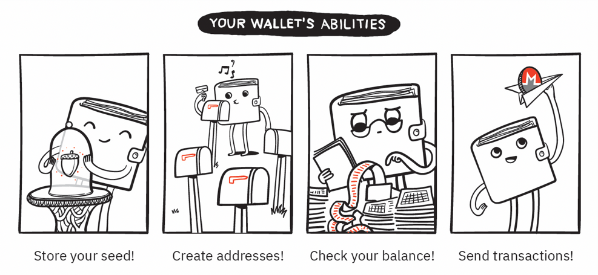
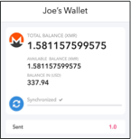
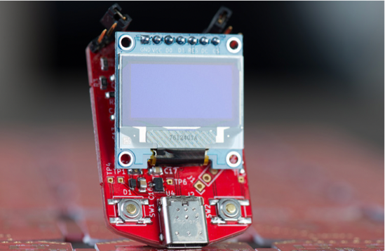
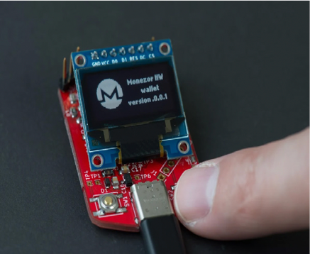
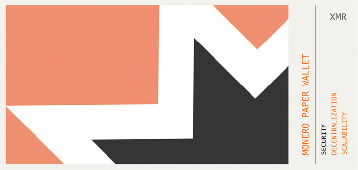
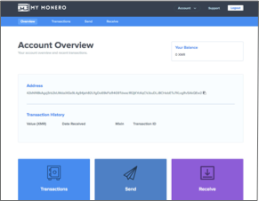
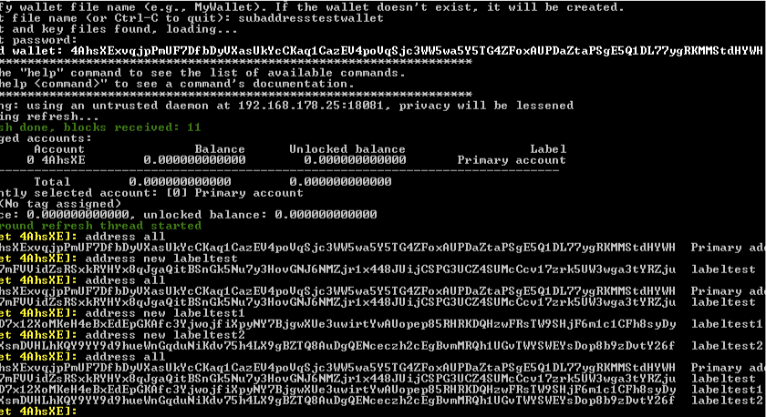
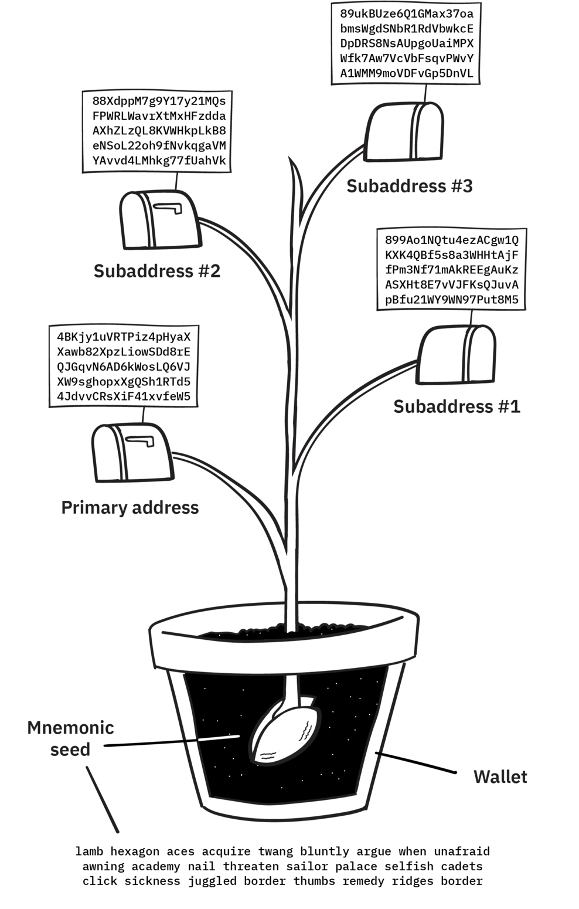
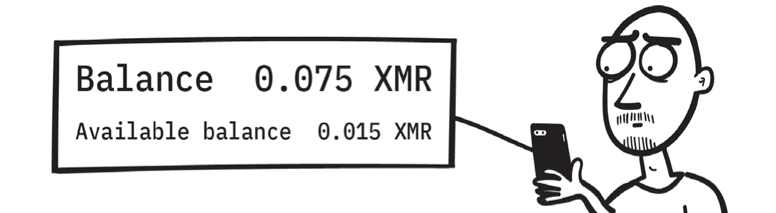
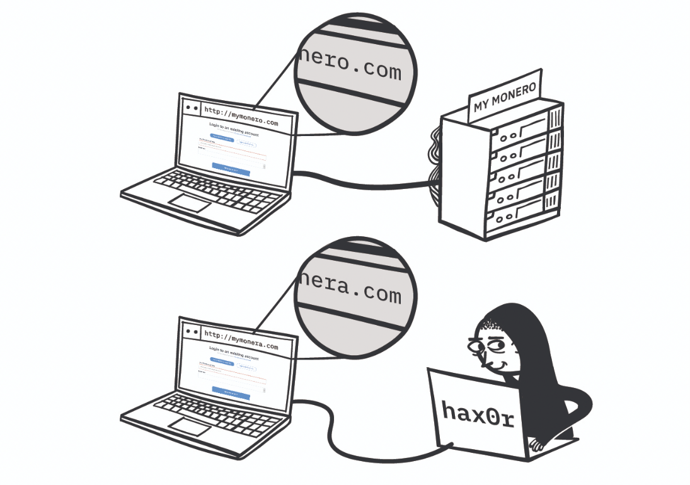

# 2 Monero入门:接收、发送及存储Monero 

上一章着重讨论了为什么要使用Monero。在本章，您将了解如何使用Monero。您不需要了解任何复杂的密码学或网络技术细节，就可以掌握Monero的使用，这些额外的信息将留待本书的后续部分。本章将涉及您开始接收，存储以及花费您的moneroj全部的实用技能。

本章的第一部分涉及Monero使用的关键概念和术语，作为适用于任何钱包或软件的一般信息。到本章结束时，您可以查找手册，使用免费的官方开源的Monero命令行接口（CLI）或图形化用户界面（GUI）软件来完成这些步骤。

## 2.1 何谓钱包? 

在您获得一些moneroj之前，您必须提前计划好在何处接收和存储您的资金。您将需要一个“钱包”来帮助您存储和花费自己的moneroj。您现在的纸币（如欧元或美元）可以存储在许多不同样式的物理钱包中。同样地，目前有很多不同种类的Monero钱包并且您总是可以将您的一些资金从一个旧钱包转移到新钱包。

钱包负责为您处理复杂的密码过程，因此，您不需要了解任何奇特的数学就能使用Monero。您只需要管理一个种子和您的(众多)地址，并学习如何使用所选钱包的功能。其他细节，诸如公钥和私钥，由钱包在幕后管理，所以直到第5章才会讨论。

您的Monero种子是一个秘密字符串，您的钱包使用它来确定和花费您的moneroj，为了便利性，它被转化为12-25+这样一连串的单词。该秘密种子就像是您在区块链上的钱的一份藏宝图。任何得到您的种子的人可以使用他们的钱包来访问和花费您的moneroj。就是因为这个原因，您在生成和存储种子时必须格外小心。不要在咖啡店创建一个钱包，因为其他顾客或摄像头可能看见您的秘密种子。以电子的形式存储您的种子是危险的（例如，存在一个文本文件或电子邮件），因为恶意软件或服务可能获得您的种子，盗走您的moneroj。

您的种子用于生成您的地址以接收moneroj。就像您的邮政地址一样，您可以向希望与您发送东西的人共享您的Monero地址。大多数钱包将以两种截然不同的格式显示您的地址——一串书面的数字/字母以及一个可视的 QR 码。如果您想给某人一个您的地址，这样他们就可以给您发送monero，那么您可以安全地分享这两个地址中的任何一个。

如果您的钱包受到物理损坏，您只需简单的将种子导入一个新的钱包，然后从您钱包损害的地方继续开始。只要您拥有种子的一个拷贝，您总是可以访问自己的资金。但是，如果您遗失了种子，那就没有方法能恢复对monero的访问。您可能熟悉口令，这通常可以通过联系管理员来重置。但种子不像口令——没有人知道您的种子，而且monero网络是不能将您的monero移动到一个新账户，如果您丢失您的种子。

在您创建一个新钱包时，大多数软件将提示您记下种子。但是一些应用程序会跳过此提醒，因此您必须主动对钱包做备份并写下您的种子。请务必立即执行此操作，否则设备的损坏会导致您永久损失资金。

图2.1-钱包实现了使用Monero的所有关键功能。

## 2.2 选择最合适的钱包 

在本节中，您将了解可用于存储moneroj的不同类型的钱包。

您可能会将您大部分的本国货币（例如欧元或美元）存储在银行或保险箱中，并在您的日常实物钱包中携带少量现金。同样，许多人将两种互补的钱包类型用于他们的密码学货币：一个方便的热钱包，可存放少量金额以备日常使用，辅之以更安全的冷钱包，用于长期保存或大量金额。

 目前有很多存储解决方案，而且它们在便利性，隐私和安全性方面各有所长。每个人的需求将决定哪一种类型的钱包最适合自己。以下描述的钱包类型主要区别在于种子存放的位置。

### 2.2.1 软件和移动钱包

我们使用软件钱包（在台式计算机或移动设备上）可以方便地存储和使用Monero。许多Monero用户的手机上都有一个便捷的热钱包，用于支付日常购买的费用。根据经验来看，只要随身带的密码学货币数量，同您惯用的普通现金数量持平就行。软件钱包将秘密种子存储在设备上，因此，如果您设备感染病毒或键盘记录程序，则可能会盗走您的moneroj。

​                           ​                                                          

​                     图2.2.a-Monerujo（Android电子钱包）             图2.2.b-Cake钱包（iOS 钱包）

### 2.2.2硬件钱包 

硬件钱包是可以执行隐私的钱包功能的物理设备，与联通的电话或计算机完全隔离。硬件钱包具有自己的内置屏幕，可以向您显示种子和交易详细信息，而无需将其发送到外部设备！

虽然硬件钱包不如软件钱包方便，但它们非常安全！鉴于它们存储和保护您的种子的方式，您可以安全地使用硬件钱包从一个您怀疑或知道被恶意软件入侵的设备发送交易。Monero社区正在开发首个完全开源的密码学货币硬件钱包，被称为Kastelo。

 

图2.3-门罗的开源硬件钱包——Kastelo

### 2.2.3 纸钱包

纸钱包提供了一种廉价的方法来存储自己尚未计划频繁转移的moneroj。您只需要打印一份公开的和秘密信息的物理拷贝就可以实现安全存储存储。因为monero种子的秘密只保存在纸上，不是数字保存的，您不需要担忧病毒或数据泄露。但是，纸钱包不便于频繁使用，因为每次您想要发送moneroj，必须将秘密转移到一个数字设备。

​                             图2.4-纸钱包是monero密钥的印刷复制品。 一定要确保没有人看到该秘密信息！

### 2.2.4 网页钱包 

网页钱包是Monero账户，您可以通过第三方托管的站点来访问它。这些在线钱包非常方便，但这是以牺牲安全和隐私为代价。网页钱包本质上有两种类型——关键的区别在于您是否知道种子。

第一种类型的网页钱包用他们自己的账户存储资金，并为您提供用户名和口令登录（请注意：这包括交易所的“钱包”）。由于您自己没有种子，因此您不能亲自控制您的资金；您必须信任该服务为您存储金钱。您应该非常警惕将moneroj存储在这些类型的网页钱包中，这些钱包本质上提供银行服务。他们可能会随时因意外或盗窃而丢失您的资金。如果该网站关闭，则您的用户名和口令将一无用处——因为您自己没有种子，所以您的资金都不见了。

第二种类型的网页钱包是将种子和资金留在您的控制权内。良好设计的网页钱包（例如MyMonero）使用安全的方法来访问您的资金，而无需将您的秘密种子发送到第三方服务器。每次登录时，您都必须输入种子，因为服务提供者不知道该种子或该种子不存储在您的设备上。这种类型的网络钱包（相对）更安全，因为第三方没有持有您的资金。他们仅为您的浏览器提供软件界面。如果无法访问此类钱包的网站，则可以将种子输入另一个钱包中，并完全恢复资金。

虽然网页钱包很方便，但建议不要将其用于长期存储或大金额存储。这两种类型都有安全方面的缺点（将您的资金委托给第三方，或者经常将您的种子输入Web浏览器），并且在两种情况下都有潜在的隐私权妥协问题。

​                                                               Figure 2.5 – MyMonero 界面. 

### 2.2.5 冷钱包

冷钱包是一个笼统的术语，用于指代纸钱包和其他离线存储的方法。例如，电子冷钱包可以是仅用于与密码学货币进行交互的电话或计算机，并且是和互联网断开连接的，除非在使用中。该设备可以使用任何操作系统，重要的部分是故意实施严格的安全措施（包括防火墙，防病毒软件以及有关仅访问受信任的网站/软件的极端警告）。种子仍在计算机上，但是您尽可能将设备与世界其他地方隔离。

图2.6-冷钱包是指仅用于存储及交易密码学货币的安全设备。上面以计算机运行Monero命令行界面为例。

### 2.2.6 Monero钱包链接  

无论您选择哪一种钱包，切记只能通过合适的渠道下载经审查的钱包。钓鱼计划和欺骗性钱包有很多。因此一定要二次检查您正在安装合法软件！如果您把种子输入到一个恶意钱包，在意识错误之前您的Monero将付之东流。

本节包含多个由Monero社区开发和信任的开源钱包的链接。

**轻钱包:** 

- Monerujo - Android 
- Cake Wallet - iOS 
- Mymonero.com – 网页钱包, 桌面钱包, Android and iOS 

**官方钱包**: 

- 图形用户界面 (GUI) - Windows, Mac and Linux 
- 命令行接口 (CLI) - Windows, Mac and Linux 

### 2.2.7 接入远程节点 (可选)

您可以通过连接到远程节点而不是将整个区块链存储在设备上，来减少同步时间和磁盘使用量。大多数移动钱包，例如上面列出的轻量级应用程序，都已自动配置为连接到默认的远程节点。如果您需要手动将软件连接到远程节点，则可以使用位于node.moneroworld.com（端口18089）上的社区资源。

节点是已经下载了整个区块链的计算机，通过节点同步他们的钱包和传播交易来帮助其他用户。运行自己的（本地）节点最有利于隐私，如果您希望帮助保护网络，则可以选择公开共享自己的节点。远程节点很方便，使您无需下载整个区块链即刻快速开始使用Monero。

 运行节点与挖Monero不同。挖矿是一个的资源密集型过程，我们到第4章才讨论。一旦区块链完成同步，运行本地节点就不会占用大量CPU或网络资源。

## 2.3 使用Monero

本节向您解释收发Monero需要了解的知识。本书的所有示例使用以下的种子：

MASTERING MONERO DEMO SEED: lamb hexagon aces acquire twang bluntly argue when unafraid awning academy nail threaten sailor palace selfish cadets click sickness juggled border thumbs remedy ridges border 

图2.7-钱包使用秘密种子生成用于接收Monero的地址。

您可以自己导入该种子来练习生成地址，检查历史交易记录和验证付款。您可以使用该种子来跟随本书中的示例，但不要将您的monero发送给它！任何阅读本书的其他人将能够花掉它！

### 2.3.1 接收Monero 

要接收Monero，您所需要做的就是与向您发送Monero的人共享您的钱包地址。大多数钱包会以两种格式显示您的地址：易于复制和粘贴的字母数字字符串，以及方便用相机扫描的QR码。这是上述DEMO种子中两种格式的示例：

您用于接收Monero的地址可以表示为文本字符串或QR码。 哪个更方便您就分享哪个。在示例中，我们有4BKjy1uVRTPiz4pHyaXXawb82XpzLiowSDd8rEQJGqvN6AD6kWosLQ6VJXW9sghopxXgQSh1RTd54JdvvCRsXiF41xvfeW5。

您分享的这个地址永远不会存储在区块链上的（这归功于一个称作隐身地址的Monero特性，在第3章中进行了概念性讨论，在第5章中进行了技术性描述）。Monero也允许您从单个秘密种子生成多个“子地址”。因此，您可以分享很多不同的地址，所有地址的钱都存放在同一个钱包中。

每个Monero账户都有一个主地址（以“4”开头）。为方便起见，您可以生成无限数量的子地址（以'8'开头）。任何地址收到的资金都将转到您钱包的总余额中。您可以在第5章中了解有关您的钱包如何处理多个地址的更多信息。

 在标记资金为已接收并且放心花费之前，钱包可能等待10-20分钟来“确认”（您将在第4章了解原因）。这是一种普遍的安全实践，因此在等待期间钱包通常显示“未确认”的交易。如果您的钱包正在等待0.06 XMR的交易确认，您可能会看见像下图这样的一些事情：

发生这种情况时无需担心！在不到半小时的时间内，资金将会确认并转入您的可用余额。

Monero支持分享您钱包的纯视图(view-only)版本，该版本可以查看所有入账交易，但不能发送或查看出账资金。此功能有许多重要用途：使慈善捐款完全透明，为授权审计师提供财务记录的访问权限以及创建访问受限的设备来监视收款。初始化纯视图钱包涉及共享一个秘密查看密钥（secret view key），该密钥与秘密种子不同。第5章介绍这个中级话题。

### 2.3.2 发送Monero  

您要发送Monero，只需输入或扫描接收者的地址，然后输入您希望转账的数额。点击“发送”，您的交易将开始！

如果您要将moneroj发送给公司，他们也可能要求您附上一个“付款ID”，来关联您的付款和订单。如果您要将moneroj发送给自己或朋友，则可以将“付款ID”字段留空。某些服务使用“集成地址”，在单个字符串中包括付款ID和地址，以方便使用并提高隐私性。

在2018年，Monero增加了使每个钱包能够生成大量子地址来接收付款的功能。因此，付款ID和集成地址的使用频率降低了。现代化商户不再给每个客户相同的地址但不同的付款ID，而是给每个客户一个唯一的子地址（此系统更简单，“用户错误”的空间也较小）。

使用免费OpenAlias系统的任何人都可以提供人类可读的Monero地址（例如“donate.getmonero.org”），而不是原始地址字符串（44AFFq5k ....）。发送到OpenAlias地址与发送到原始地址没有什么不同。但是，设置新的OpenAlias地址是一项更具技术性的任务，将在第7章中介绍。

您的钱包会增加一小笔交易费，用来对网络转发和处理您的交易进行补偿。您的钱包会根据当前的Monero网络负载，交易的紧急性以及其他一些幕后考虑因素，建议您支付适当的交易费用。您可以在第4章中了解更多信息有关交易费用如何运作以及为什么交易费用维持网络是必需的。

### 2.3.3 如何检查付款证明

考虑到Monero的匿名性，您可能想知道人们如何证明付款已发送。除了可选的付款ID外，Monero还具有第二个功能，可以有选择地披露资金已发送的证明。这是通过共享只有真正的发送者才能生成的交易密钥(transaction key)来完成的。

示例

假如您的朋友Khan和Maria，每人欠您一顿饭钱：0.06552376 XMR 。您只接收到1笔打款，信息如下：

数额: 0.06552376 XMR 

交易 ID: 4b540773ddf9e819f0df47708f3d3c9f7f62933150b90edc89103d36d42ca4b7 

您接收的子地址: 899Ao1NQtu4ezACgw1QKXK4QBf5s8a3WHHtAjFfPm3Nf71mAkREEgAuKzASXHt8E7vVJFKsQJuvApBfu21WY9WN97Put8M5

这是演示钱包在2018年4月20日接收到的真实交易。您可以通过区块链浏览器看见一些信息。但Monero发送方总是不可知的。Khan和Maria都声称他们打了饭钱，因此，您要求二人提供交易密钥。

Khan: 

OutProofV1N4Y5pUJEnRACJyB5C3zK1zTqAihdnN8MfVZhEWfD13Z2N7Npt1uxa1EY7N7jnvuJF76tXU wKrakvZSxTj4Zux5SpavFb4X1jRcLAJ2b5hqviQPiS 58j2qH53QL44CJEgHtY5 

Maria: 

OutProofV1To53Qu2gegZbUevosKCTwrEdqiECgFyUygutXMEdhrHg1EtXMrFNaszWYFjdU4aXFZ2iPF8G8jzoDJzCoW5dsWvb4mVN65abAya3U47cGXs7WABrTzG5aPfV4YBANhwPgwD2 

当您检查两者的交易密钥时，Maria的密钥确认打款到您的地址而Khan的密钥返回“无效签名。”您可以使用上述的地址和交易密钥亲自实践一下。

## 2.4 运营安全

图2.8-网络钓鱼攻击通常使用略有不同的URL来诱骗用户将其种子或密码输入到攻击者的真实网站副本中（例如，www.\mymonera/.com而不是www.mymonero.com）。 您要始终仔细检查URL，特别是跟随的链接。

Monero可以让您成为自己的银行，因为没有人可以控制您的资金！除了您自己。这种基层的财务授权是密码学货币的最大好处之一。但是，能力有多大，责任就有多大！牢记运营安全性（OpSec）对于确保您自己和资金安全至关重要。

### 2.4.1 缄口不言拥有多少Monero

之所以存在这样的说法是因为“口风不严战舰沉”。当您公开披露您拥有的Monero时，您可能会无意间使自己成为骗局或盗窃的目标。尤其在在线论坛和社交媒体的情况下也是如此。

诈骗者和小偷在互联网上四处寻找揭露有关其自身和财富的可利用信息的个人。

大多数人都知道不应该在社交媒体上公布他们银行账户的余额或退休金的投资组合。这是有安全风险，无礼的，当涉及财富失衡时，更会使人际关系变得尴尬。但是，很多人天真地宣布他们购买了多少Bitcoin或Monero。

请记住，密码学货币的价格是波动的，并且已知会急剧上涨。从2012年开始，一篇帖子指出“我只是在Bitcoin上花了50美元，以防Bitcoin持续增长”，这在当时似乎并不算什么，但到2017年底，50美元（2012年约10 BTC）的价值将近一百万美元，不到5年！互联网上的消息很难擦除，因此避免这种情况的最佳方法是永远不要发布。

考虑到人们对密码学货币投资的普遍兴趣，这里有一些关于持股和投资组合构成的讨论。您应该始终以百分比而不是绝对金额说话。图（下图）显示了如何计算投资组合余额，因此您可以在不泄露隐私信息的情况下讨论储蓄策略。

 

### 2.4.2 保护种子安全 

您的资金和您的种子一样安全，这里有两大问题需要牢记：意外损失和偷窃损失。

为了避免由于意外造成的损失，请始终确保将种子备份在安全的地方。并经常问自己：“如果我的电话或者这个网站宕掉，我有办法获取我的资金吗？”您应该考虑将种子的第二份手写稿保存在第二个安全的位置。如果房屋被洪水或烧毁，您不想丢失设备和备用种子的话。

为避免因盗窃而造成损失，切勿与他人分享您的种子或密钥。任何拥有您种子的人都可以100％窃取您的资金，而Monero的隐私功能将使您无法确定它们去了哪里。

### 2.4.3 交易注意事项

当向新人或交易所发送任何大笔交易时，您应该始终首先通过先发送小额交易来测试地址/服务。当将任何大笔交易发送给新人员或新地址时，您应始终先发送一次小规模的试点交易，然后等待接收者确认它已到达。这是一个预先发现错误的重要习惯，因为没有针对密码学货币的“撤消”按钮。

对于每笔密码学货币交易，请始终仔细检查钱包地址以确保其正确无误。即使您复制并粘贴地址，也要再次确认其粘贴正确并完整。黑客创建了可操纵剪贴板中密码学货币地址的恶意软件（用攻击者的地址替换了真实接收者的地址）。如果您仔细地检查地址，则可以在向黑客“捐赠”之前捕获该恶意软件。

### 2.4.4 交易所安全  

交易所为您创建自己的钱包，通常不与您共享种子。这是有风险的，因为如果交易所受到攻击，关闭或其他情况消失，您将无法收回资金。有句名言：“不是您的密钥？不是您的比特币！”是指能够控制您的密钥，进而控制您的资金的钱包和服务。

如2.4.2所述，您应该总是问自己“如果该网站消失了，我是否有办法获取我的资金？”一个好的经验法则是，只有在您打算在不久进行交易的情况下，您才将Monero保存到交易所。否则，把它移到您控制的钱包里。

## 2.5 商家接入Monero 

### 2.5.1 Monero是商家理想选择 

在本章中，我们介绍了Monero一般使用的所有关键技术。本节介绍了一些其他工具，可帮助商家将Monero集成到他们的系统和服务中。如果您不涉及商业入账付款，则可以跳到下一章。

接受Monero付款的商户可从快速、私人和不可逆的交易中获益。这里有多种工具旨在确保在线和实体企业接收Monero是“用户友好”的体验。

当然，任何人都可以使用上一章中的常规技能来设置钱包，并立即开始接受Monero。但是，本章中提到的工具旨在帮助希望自动进行付款集成和诸如开具发票和收据之类的流程的企业使用。

### 2.5.2 接受Monero的友好工具 

Monero Integrations支付网关允许任何在线商店来添加Monero支付选项，通过简单地安装几种流行的内容管理系统设计的任何一个插件。Monero Integrations解决方案的创建（由本书的作者创建）与Monero的精神相一致：整个项目是免费，开源，去中心化和私有的。交易直接发送到您的钱包，因此在信任第三方进行付款时不会出现任何隐私或安全方面的问题。

Kasisto是接受Monero的第一个销售点系统，并且是一个不需要第三方的开源项目。该应用程序旨在手机或平板电脑上在店内使用，并且可以通过在挖矿之前检测到交易来几乎立即接受付款。您可以在Kasisto GitHub上尝试演示。

另一个付款方式是GloBee，它使商家可以接受密码学货币和信用卡付款。GloBee是第三方公司，它允许他们提供其他功能-例如，接受许多类型的代币，这些代币可以立即结算到Monero，其他密码学货币，甚至是法定账户（例如欧元或美元）。这使您的企业可以选择接受密码学货币并立即以本国法定货币付款，从而避免了价格波动风险。

如果您想从零开始深入到编码和构建自己的支付选项，您可以在第7章中了解所有关于创建后端的内容。

