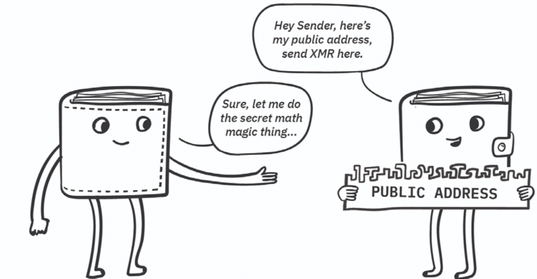

# 3 门罗运行机制

前两章覆盖了您需要了解为什么使用Monero（第1章）和如何使用Monero（第2章）的所有知识。到现在为止，你已经学会了开始使用Monero的一切！

这本书的其余章节包含的额外细节，适合那些希望更深入理解Monero幕后如何运作的读者。第3章和第4章描述了底层技术，如Monero的隐私特性、Monero区块链和挖矿过程，我们专注于理解这些概念，而不深究高等数学。后面的章节包含了具体细节，适合开发者们和密码学极客。

## 3.1 交易和账本

为理解Monero的隐私技术做好准备，我们将考虑moneroj是在账本上如何发送和接收的。在本章中，我们将重点讨论区块链功能——它作为一个固有的防篡改共享数据库，保存了一份Monero交易的列表。有关区块链安全性(挖矿、哈希等)的详细信息是另一个主题，留在第4章中。

当您第一次设置钱包时，它会生成一个新种子，您需要将其保密并用于访问区块链上的moneroj。此初始化过程在您的设备上进行，并且可以完全在线下执行；在钱包生成过程中，网络不会向外广播或记录任何内容。

在这幕后，您的钱包会从您的种子中计算出两组密钥。您的私钥是一个受到严密保护的秘密，因为您使用它们来证明自己的身份并访问自己的moneroj。您的公钥，顾名思义，要被其他Monero用户知道。公钥和私钥成对生成，并满足特定的数学属性，这些属性在密钥之间创建特殊的联系。

要接收moneroj，您将自己的地址（由公钥创建）提供给发送者。当某人（一位客户，交易所或朋友）向您发送Monero时，他们将广播一笔交易，该交易将他们的一些moneroj转入到账本上的新条目中，您（且只有您）可以使用自己的私钥解锁该条目。

用技术术语来说，他们的交易**输出**存储在区块链上，您可以在闲暇时使用自己的私钥进行访问和花费。由于密码学货币使用的“输出”一词的含义与其典型定义不同，因此该术语可能有点令人费解。

每次您收到moneroj，你就会获得又一个输出；每次您花费moneroj，您就会用完自己的一个输出，并为别人产生一个新的输出。实际上，您“拥有”的所有moneroj都只是您的私钥解锁的区块链上的全部输出。在有人给您发送moneroj之前，Monero区块链上不会有与您的私钥相关联或可访问的任何输出。

当您的钱包正在扫描或同步时，这通常意味着它正在使用您的私钥来检查区块链上的所有交易和输出以识别相关条目。您的钱包余额是您的私钥可以解锁和花费的这些输出的总和。

当您从钱包中发送moneroj时，您会用掉一些输出作为您广播到网络的交易的输入。从概念上讲，区块链只是这些交易的记录，每笔交易消耗发送者的输出作为输入，为接收者生成一个新的输出。

我们略微简化了上述过程，以传达关键部分（私钥/公钥，交易，输入/输出）。以下部分提供了支撑Monero隐私特性的关键概念的通俗解释。

## 3.2 隐私技术概述

上面介绍的一般原理和术语为大多数密码学货币所共有。Monero通过几种独特的密码技术提供了功能和隐私的加固，这些技术可以保护用户及其交易活动不受公众的关注。

图3.1显示了这些互补技术如何协同工作以保护敏感交易的详细信息：

• RingCT隐藏交易数额。

• 环签名通过混淆所使用的输出来保护发送者。

• 隐形地址确保接收者的地址未记录在区块链上。

• Kovri通过混淆广播来源以及掩盖Monero交易活动的网络痕迹，打破了交易和实际位置之间的关联。

图3.1-Monero的几种隐私技术协同工作，隐藏了交易产生的所有敏感信息。

### 3.2.1 环机密交易

RingCT是一种密码技术，可隐藏任何交易中发送的moneroj数额。对于大多数密码学货币，交易数额以明文形式发送，任何人都可以看到。RingCT通过允许发送者证明自己有足够的moneroj来进行交易，而不会透露该数额的值，从而使得此敏感信息保密。这都要归功于密码学中的承诺和范围证明。

当您发送moneroj时，您将以一种秘密方式“承诺”该数额，仅向网络披露足够的信息以确认交易的合法性，但不会公开揭露数额本身。一个有效的承诺保证了交易不会欺骗性地创建或超支已有的moneroj。

**范围证明**是RingCT中的另一重要机制，它是一种确保承诺值大于零且小于一定数量的方法。这对于防止发送者承诺负的或不可能的高额的moneroj是必要的。总体而言，承诺和范围证明可确保moneroj供应量免受欺骗性操作和造假企图。

在使用RingCT之前，Monero交易被划分为特定的面额（例如，12.5 XMR将发送为10 XMR + 2 XMR + 0.5 XMR），并且交易数额对外部人员可见。RingCT于2017年1月启用，并迅速被广泛采用。在激活后的1个月内，大约有98％的新交易已经自愿使用RingCT协议！

根据Monero的强制默认隐私策略，2017年9月之后，所有Monero交易都必须使用RingCT。要花费任何RingCT之前的旧输出，必须首先将其转换为具有隐藏数额的RingCT输出。

### 3.2.2 隐地址

所有的Monero交易都使用*隐形地址*来保护接收者的隐私。为了避免将接收者的钱包地址记录到区块链上，每个Monero交易都被发送到唯一的一次性地址上。接收者可以访问发送到隐形地址的资金，而不暴露其钱包公开地址或其他交易的任何关联。

 

图3.2-Monero的发送者的钱包从接收者的公开地址生成用完即可丢弃的一次性隐形地址。 交易和区块链中仅包含隐形地址。

为了对使用随机的一次性代码来保护接收者的身份有些概念，请想象您希望向您的朋友安德烈（André）提供一些有关应对敏感疾病的书籍。不幸的是，您将要离开城镇去度假，而安德烈（André）会在下周到该城镇。也许您可以拜托友好的邻居暂时保存这些书，然后将其转交给接收者安德烈。

您的邻居将验证试图声称是这些书籍的实际接收者的任何人。由于您的朋友是一位注重隐私的人，因此不宜直接告诉您的邻居核查其身份ID中是否有“André”这个名字。在保护安德烈隐私的同时，您如何安排此次交换？您可以简单地编写一个一次性的随机码，然后告诉您的邻居将该书交给提供该随机码的人（例如，将这些书交给知道短语“ PolarComboTango357”的人）。您的邻居将能够追踪这些书籍并将其交给André，而无需了解有关接收者的任何信息。

您可以使用该随机无信息码来防止邻居知道您的图书接收者，无独有偶，Monero使用一次性码系统来防止网络了解Monero接收者！与其将收款人的地址明确记录在区块链上（类似地，“将书交给安德烈”），不如总是将资金发送到一次性的“隐形地址”（类似地，“将这些书交给知道短语PolarComboTango357的人”）。第5章讨论了仅用于为接收者提供安全隐形地址的密码技术，但下面将详细说明要点。

这些一次性地址是如何生成的？ 您的Monero钱包的公开地址是95个字符的字符串，其中包含两个在数学上派生自您的种子的公开密钥（公开可视和公开花费密钥）。当有人向您汇款时，他们将使用您地址中的公钥以及一些随机数据来生成唯一的一次性公钥。这些记录在区块链上交易中的一次性公钥被称为隐形地址，因为网络或外部观察者不可能将这些随机码关联到原始钱包。

图3.3-在透明的区块链（例如比特币）上，可以轻松地链接和查看到同一公开地址的所有交易。 Monero的隐形地址是不可链接，且永远不会重复的，因此其他用户和发送者都看不到接收者的财务活动。

请注意，子地址与隐形地址不同。子地址是未记录在区块链中的可重复使用的公开钱包地址。发送到单个子地址的多个交易都将指向不同且不可链接的隐形地址。

通过不在区块链上记录钱包地址来改进隐私是实施隐形地址的一个明显的好处。一个更大的好处是，使用这些唯一的一次性密钥可以防止把同一地址的多次付款链接在一起！

假设您创作了一些公共艺术并发布了用于密码货币捐赠地址。如果您使用带有透明区块链的币（例如比特币），则转入该地址的所有输入交易都将以可搜索的可链接形式永久记录。任何人都可以使用区块链浏览器查看您收到了多少比特币捐款，捐款数额以及您是否转移了资金。每次转入的比特币交易都通过您公开共享的地址在账本上建立索引。

反之，如果您发布一个Monero地址，则您的捐款不会受到公众审查。每个捐赠者都会生成一个唯一的一次性隐形地址，并将其记录在账本中。您在项目旁边发布的公开地址将永远不会在交易中直接引用，并且隐形地址不会提供有关接收者的任何信息。由于每个捐赠者混入随机信息来创建其交易的隐形地址，因此一个捐赠者无法识别由另一捐赠者生成的隐形地址。

所有Monero交易都必须使用隐形地址，以确保整个网络的隐私性。您的钱包在生成交易时会自动从公开地址中创建隐形地址。

### 3.2.3 环签名

环签名是Monero的一项功能，旨在通过混淆所花费的moneroj的来源来保护交易的发送者。在介绍环签名之前，我们将首先介绍数字签名的概念。

*数字签名*是一种通用的密码学方法，用于确认数据或消息的真实性和来源。我们可以利用公钥检查签名，以确认签名者的身份，并验证签名的消息是否完整且未修改。若已签名的数据哪怕更改了一个字符（无论是出于故意的篡改还是偶然的误传），则签名将变为无效。

数字签名的各种实现方式是所有密码学货币的关键组成部分。若您要花费您的一个输出，您需要在网络上创建一条描述交易的消息，并使用相应的私钥对其进行签名，然后将结果广播到网络。在执行交易之前，网络会检查签名的有效性，以验证消息是否被不具有正确私钥的第三方更改和/或伪造。

透明的密码学货币（例如比特币），其每个描述交易的消息都明确声明正在使用哪些输出。这对于轻松记账很有用，因为网络仅保留未使用的交易输出（UTXOs）的记录，这些交易被视为新交易的有效输入。如果有人尝试花费相同的比特币输出两次，则这种欺诈性的第二次交易将被立即拒绝，因为网络知道所有者已经花费了该输出（当他们签署并广播了第一笔交易时）。不幸的是，这种简单的所有权证明通过明确地指出资金来源，并指出何时花费给定的输出，对隐私有极大的损害。

Monero使用一种不同的方案，称为环签名。这种群组签名方法允许一个成员代表该组成员对消息进行数字签名，由于混入其他成员的公钥，因此不清楚谁主动对该消息进行了签名。我们可以用密码方式验证该环成员中的一位成员签署了该消息，但无法确定哪个成员实际签署了该签名。

环签名用于Monero中，以混合来自区块链上多个输出的密钥，从而使实际使用的输出变得模糊不清。假设玛丽亚想花费她的一个Monero输出。她的钱包将半随机地从区块链上选择其他几个过去的输出（不属于Maria），并将它们的公钥作为托儿混入环签名中。网络能够验证正在花费其中一个输出，但是这些托儿和真实花费者在密码学上是无法区分的。

环签名保护所有交易中的发送者，因为发送者和Monero网络无法确定哪个环成员是该笔交易的真正来源。环签名的一个重要后果是，外部观察者无法准确证明该输出已花费掉！事实上，一个出现在环签名的输出是无法区分它是真正被花费的输出，还是只是被动地用作环的一个托儿。

由于无法确定是否花费了特定的输出，您可能想知道是什么阻止不道德的用户尝试花费相同的输出两次？对于一个输出对应一次花费的透明区块链（例如比特币），这是一项微不足道的任务：任何经过密码签名和传输一次的输出都被标记为已使用且无法再次使用。但是，Monero的输出可以在使用前和后都出现在环签名中，因此必须通过其他方式来防止输出的重复使用。

这是通过利用每次交易生成和记录的*密钥镜像*来完成的，这些密钥镜像是唯一地从所花费的实际输出中得出的。网络无法确定哪个环成员连接到密钥镜像；但是，其他参与者只需要检查密钥镜像是否已被使用过。如果恶意用户尝试花费两次相同的输出，它将两次生成相同的密钥镜像，并且网络会立即拒绝欺诈性的第二笔交易。多亏有了密钥镜像，即使不知道花费了哪些输出，网络也可以防止输出重用！

Monero网络最初并不要求使用环签名，不幸的是，没有托儿的零混合(zero-mixin)交易允许破坏隐私。这些早期的交易具有与透明区块链相同的结构和弱点，即通过明确地识别发送者和接收者，并揭露何时花费输出。从2016年开始，该网络开始要求在每个签名有2个环成员，强制发送者默认使用隐私。在2017年末，该环的最小大小增加为5个可能的签名者，并在2018年初再次增加至最小的7个潜在签名者。

图3.4-每个Monero交易均由一组“环签名”授权，以保护发送者的隐私。

请注意，在2016年至2018年之间，环大小策略被构想为最小的混入数量，并且允许用户根据需要创建带有更大环的交易。理论上，人们可能会认为在交易中使用更多的托儿可以确保更多的隐私。但是，有一个实际的问题要考虑——当绝大多数交易使用最小的环大小时，较大的环显得异常，这对隐私起反作用。

这在2018年末的网络升级中得到解决；现在，与其指定最小的环大小，网络强制使用固定大小的环。在撰写本文时，所有交易都必须使用具有11个成员的环签名。随着统计威胁模型和最佳隐私实践研究的不断发展，这个数字将来可能会增加。

### 3.2.4 Kovri和流量分析

任何连接到因特网的设备都被分配一个IP地址作为标识符，以助于将流量路由到正确的用户。但是，这个IP地址可以很容易地连接到用户的实际位置和身份。

将Monero活动和交易链接到IP地址有几个显著的缺点。如果对节点连接日志的IP地址进行分析以识别Monero用户，则可能会部分绕开上一节中描述的保护Monero用户的密码方法。

当Monero网络活动被连接到实际位置和身份时，可能发生不幸的情况，这是值得考虑的。

由于向Monero网络的广播会显示IP地址，因此接收交易的节点可能能够识别发送者的实际位置。尽管Monero的其他隐私特性使得其很难仅从区块链数据链接交易，但监视节点观察来自同一个IP地址的多个交易可以推断这些交易可能是连接的。

除了这些隐私问题之外，暴露的IP地址还可以实现潜在的审查。恶意节点可能选择不转播来自某些个人或团体的交易。更糟糕的是，IP地址披露的地理信息可能会导致敌手恶意访问密码学货币的用户。

IP地址和Monero活动之间的联系不仅对广播交易的用户构成威胁。当前，互联网服务提供商和其他监视方可以看到经过节点的网络流量，如果节点所有者的政府或互联网服务提供商选择对密码学货币做出负面反应，则可能使节点所有者面临风险。

如果密码学货币矿工们的IP地址连接到他们的网络活动，他们也可能会受到不公平的对待。恶意方可能会通过审查其区块来寻找对某些矿工进行攻击，这可能是由于某种意识形态上的分歧，或者是为了限制非政府或非公司采矿。

显然，Monero生态系统中的所有各方都受益于隔断其网络活动与IP地址（以及实际位置/身份）的联系。如果您必须在受监控的连接上隐藏对Monero的使用，当前有几种方法可以实现这种类型的隐私。

一种选择是虚拟专用网络（VPN），它通过您的网络服务提供商和政府无法监视的加密连接发送流量。这通过在您和VPN服务器之间建立安全隧道来起作用，因此您的流量会与其他用户的数据混合在一起，并从其他IP地址进行广播。请注意，提供VPN的服务可能会保留日志，因此请务必选择使用尽职尽责、值得信赖的公司。

另一种选择是使用洋葱路由器（“Tor”）通过中继节点的专用网络路由您的流量。Tor最初是由美国海军研究实验室开发的，并被新闻工作者，情报机构以及必须采取额外步骤以避免监视或审查的人员所使用。Tor是一个免费的去中心化地开源专用网络，旨在使任何参与者都无法识别任何特定广播的来源。可以通过专用的浏览器访问Tor，而且具有高度隐私需求的用户可以使用Linux发行版（例如Whonix）通过Tor路由所有流量。

Monero社区还支持了Kovri的开发，Kovri是一种基于分布式Invisible Internet Project（I2P）规范的隐私方法。Kovri被设计为使用加密和复杂的路由技术来创建分布在网络上的专用网络，也可用于其他应用程序。

在将Kovri或类似功能直接集成到Monero中之前，鼓励所有对网络流量分析有特别关注的用户使用Tor或可靠的VPN提供商来隐藏其连接和IP地址。

## 3.3 结束语

Monero使用多种独特的隐私技术来保护网络的各个部分以及所有交易中的所有参与方。RingCT隐藏每笔交易中发送的数额。环签名通过隐藏资金来源来保护发送者，而隐形地址可确保接收者的地址未记录在区块链上。Kovri是一项即将到来的路由技术，可打破您的Monero活动与您的实际位置/身份之间的联系。

这些技术共同确保了Monero用户的匿名性，并且资金不可追踪。通过密码技术消除在区块链上用于分析交易的所有链接，Monero实现了可替代性，这是实用货币的必备特征。现在，您已经阅读了本章，您可以更好的理解在第1章中讲述的使用案例中Monero是如何保护个人隐私的。