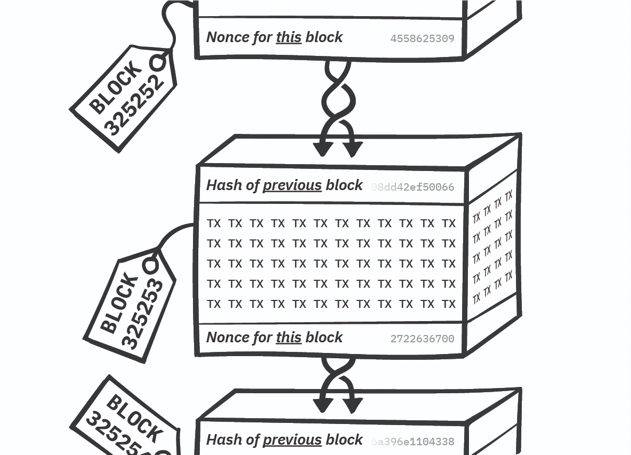
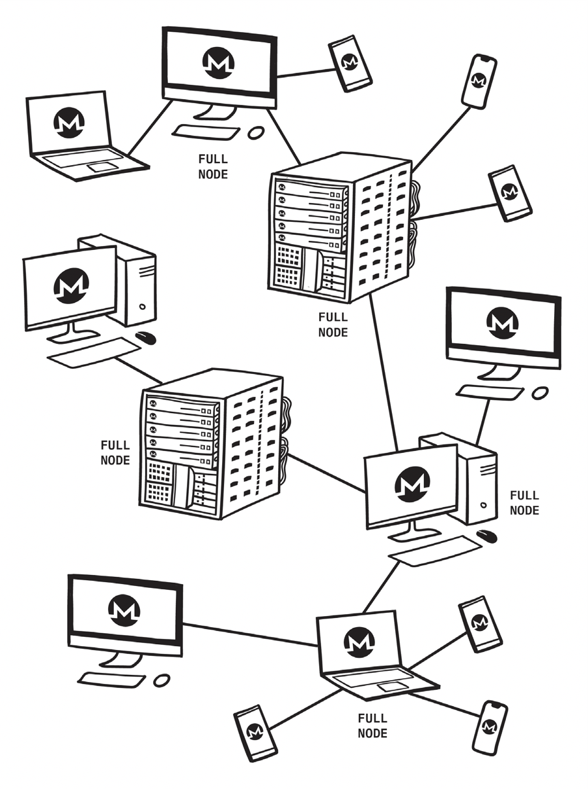
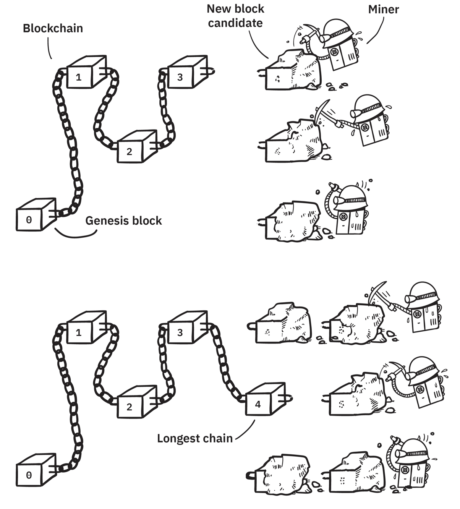
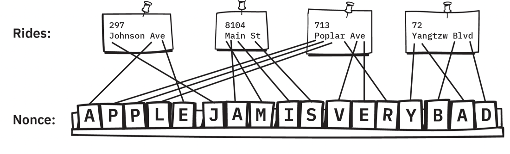
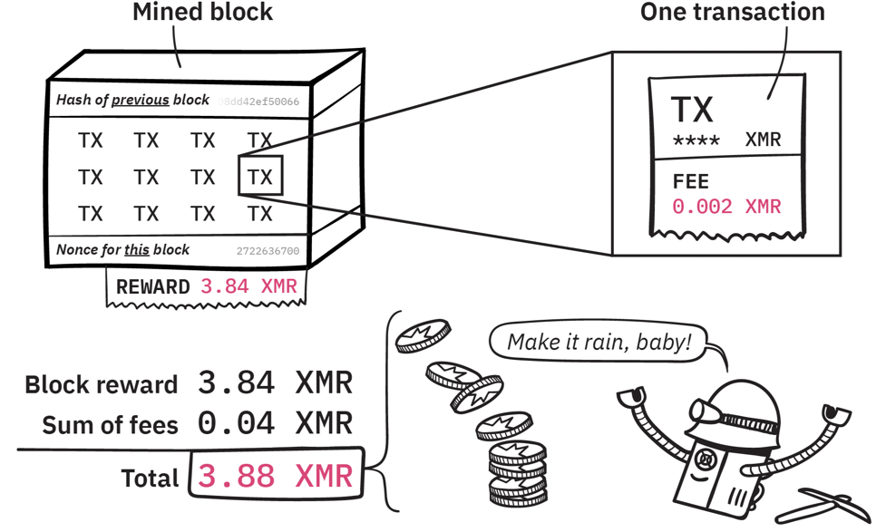
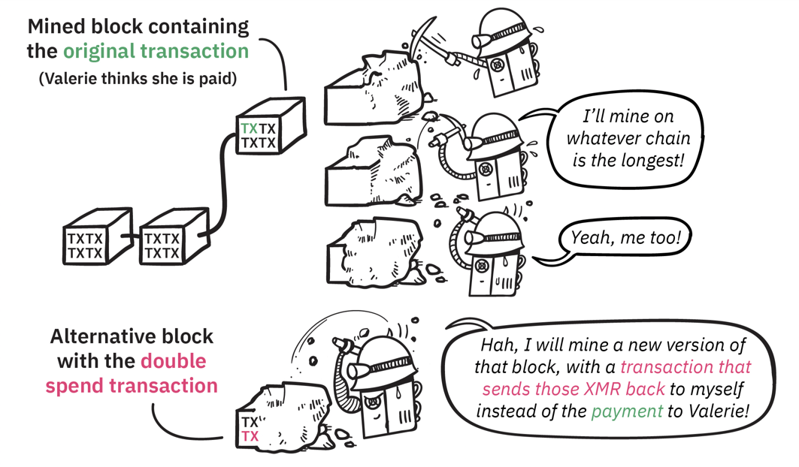
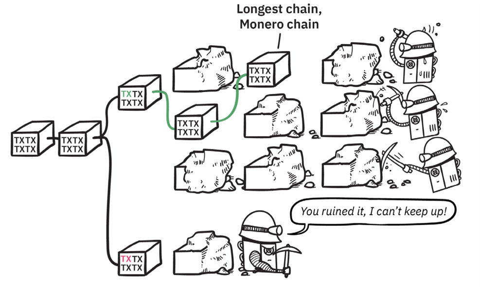
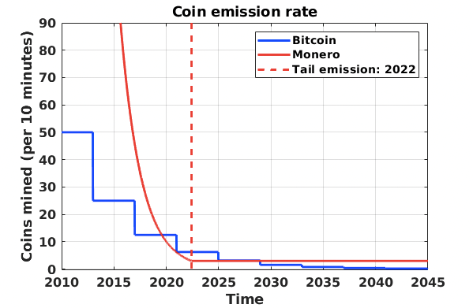
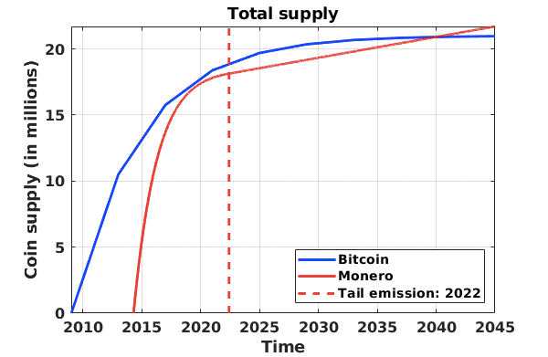

# 4 Monero网络  

在本章中，您将学习区块链技术背后的关键概念，以及Monero矿工如何保持账本安全。我们将首先阐释区块的结构，其连接成防篡改链的方式，以及矿工如何使用工作量证明就账本的一致版本达成共识。关于矿工话题，我们将讨论新的moneroj的来源，以及这些币如何发行到系统中。在本章结束时，我们将深入探索一些密码学概念（哈希和随机数），以真正掌握挖矿的实际过程。

# 4.1 简化区块结构

上一章讨论了交易的构造方式。总而言之，您的钱包起草了一条消息，其中包含将您的一个输出转移到新接收者的说明。在您的钱包使用私钥对消息进行数字签名授权消息之前，会对消息中的敏感信息（发送者，接收者，金额）进行密码学处理。

在本章中，您将学习如何处理交易消息以执行实际的转账。当您的钱包广播此消息时，Monero网络会临时把该请求存储在一个待处理的列表，也被称为内存池。Monero矿工从内存池中收集这些未确认的交易，并将它们打包在一起成为区块。下面显示了一个简化的区块：



图4.1-每个顺序编号的交易块都必须包含一个随机数和对前一个块的哈希的引用。

每个区块都包含一组交易，前一个区块的密码链接（称为哈希），以及矿工用来完成该区块的特殊数字的位置（称为随机数）。

如果您想知道哈希和随机数的工作原理，在本章末尾会有一个友好的介绍（您可以直接跳到第4章的最后一节，如果您对密码技术感到好奇，请立即阅读。）您只需要了解两个概念就可以知道这些技术如何起到保护区块链的作用：

1. 哈希是一项安全功能，证明每个区块都直接链接到前一个区块的未更改版本。如果攻击者试图篡改账本中的任何一点，那么即使是最小的修改尝试也将是显而易见的，因为哈希将在随后的每个块上引发一个红色标记。

2. 随机数是一个特殊的字符串，用于完成该区块并将其标记为区块链。我们在计算上很难找到满足最终确定和密封区块所需要求的随机数。矿工将大部分时间和精力都花在寻找有效的随机数上。这是无法为计算随机数而提前准备计划，因此搜索必须从每个新块开始。随机数在数学上没有意义，只有一次性随机字符字符串。

## 4.2 节点——网络骨干

### 4.2.1 节点将网络数据转发给对等节点

到目前为止，对“Monero网络”的提及大多隐藏了其组成的细节。您的交易实际上如何通过这个模糊的“网络”传播到矿工和其他用户？其实是分布在地球上的成千上万个Monero节点相互连接，从而迅速共享交易和区块的消息。

这些节点构成了对等网络，从而为Monero用户实现了有效而灵活的通信。运行节点不需要任何特殊设备或专业知识——如果您现在下载并开始安装Monero软件，则在阅读完本章之前，您就有自己的Monero节点！



图4.2 -Monero使用分布式的对等网络，该网络由志愿设备组成，彼此共享新数据。节点保留区块链的完整副本并创建网络的主干。由于运行节点需要大量磁盘空间，因此某些设备（尤其是移动钱包）将连接到远程节点以请求信息并广播交易。

Monero的对等网络中没有“特殊”或“超级”节点。所有节点（包括您的节点）都是平等的参与者，致力于共享资源和工作负载。节点托管在各种形状和大小的计算机上——笔记本电脑，台式机，服务器，甚至虚拟机。

### 4.2.2 节点存储区块链 

当初始化新节点时，必须首先下载整个区块链并验证密码链接，例如哈希和随机数。初始同步可能需要几个小时，因为节点建立区块链的本地副本，同时需要确认每个交易和区块的有效性。每个节点接收来自多个对等节点的传输数据，而不是通过单个连接到中心源下载区块链。节点无需识别或信任其对等节点，因为数据的有效性是通过密码学确认的。

任何Monero钱包软件（例如Monero GUI，电话应用程序等）都必须访问区块链的副本，以执行诸如检索交易历史记录，计算账户余额和制定交易等关键任务。钱包在与同步节点进行通信之前无法起草交易，因为该软件需要查找并统计相关的未花费的输出。但是，您的地址都可以收到moneroj，无论您是否已连接到一个同步好的节点（在钱包下载并验证该区块之前，这些moneroj不会显示在您的余额中）。

### 4.2.3 本地节点 vs 远程节点

在本地存储/验证整个区块链，使您的钱包可以与自己的账本副本进行交互的过程称为运行本地节点。使用这种类型的设置时，您的钱包仅与您个人节点的区块链副本进行交互。运行本地节点需要大量磁盘空间（在撰写本文时，磁盘空间约为60 GB），这并不适合所有设备，例如手机。

幸运的是，可以将钱包软件配置为使用远程节点，而不是您自己的本地节点。这意味着您的钱包将连接到其他人的节点，并仅请求有关您的输出的信息。大多数移动Monero钱包默认使用远程节点，以保持应用程序轻巧。Monero GUI和CLI钱包可以配置使用本地节点或远程节点。

使用远程节点没有安全风险；您的种子和密钥不会被泄露，因此远程节点运营者将无法控制您的资金或解密任何受Monero功能保护的信息，例如RingCT（隐藏交易数额）或隐形地址（混淆接收者地址）。

在使用远程节点时，会有一些轻微的隐私妥协，因为节点运营者知道您的设备广播交易或连接更新的时间和IP地址。即将到来的Kovri隐私技术将大大减轻这些风险。如果您使用自己的本地节点，则您的钱包会扫描您的区块链个人副本以获取交易历史记录，而不是依靠第三方来检索此信息。

## 4.3 矿工创建新区块  

### 4.3.1 矿工添加新区块到最长链

矿工从内存池中收集待处理的交易，通过检查密码证明和签名是否有效来验证它们的真实性，并检查密钥镜像是否以前没有使用过（请参阅“3.2.3环签名”来回顾为什么这很重要）。

为了准备一个区块，矿工需要起草一个要包含的交易列表，以及上一个区块的哈希来提供一个密码链接。最后，矿工努力寻找一个可以用来完成这个区块的随机数。

在任何给定的时刻，有数千名矿工分别工作（或以团队形式工作，称为矿池），寻找完成当前交易块的随机数。一旦矿工或矿池找到一个随机数来完成他们的区块，他们就会向网络的其他节点宣布他们的版本。在接收到这个完成的区块后，其他矿工和节点将其附加到自己区块链的副本中，从而将链的高度增加一个区块。新区块引用的交易将从内存池中删除，其他矿工将放弃自己在该区块上的（未完成的）工作，并开始准备下一个块。

### 4.3.2 任务难度确保稳定性和公平性

如果两个矿工在同一高度独立完成一个区块的两个不同版本，由于Monero生态系统的全球性和网络延迟会导致的不可预测的传输延迟，有时会导致区块链的瞬间分叉。假设南美洲的一个矿工是第一个完成一个区块的，但是欧洲的另一个矿工在接收南美洲的广播之前完成了他们自己的副本。在这种情况下，西半球可能暂时使用与东半球不同的区块链。在短暂的时刻，存在两个相互竞争的Monero 账本，它们可能略有不同（取决于每个矿工从内存池中选择的未处理的交易）。有人可能会认为这将是一个灾难性的事件！



图4.3-矿工们竞相用一个新的区块来延伸链条。（上图）区块链的高度为“3”，因此每个矿工都在其版本的区块“4”上工作。（底部）区块“4”首先由中间的挖矿者完成，因此他们的版本被添加到共享区块链中，所有的挖矿者切换到寻找区块“5”的随机数。

相反，这种情况通过优雅地施加一个简单的规则可以轻松解决：矿工都同意在最长链中的下一个区块上进行开采。这是Monero去中心化共识协议的关键部分，它使Monero网络在意外分叉后能够灵活地重组为一条链。矿工们没有立即继续尝试解决差异块，而是继续为他们的版本完成下一个块。

在接下来的几分钟内，一名矿工将解出随后的区块并将其添加到他们的链中。一旦发生这种情况，它们的版本就会变成最长的链，因此其他矿工和节点会迅速采用该副本并丢弃替代孤儿块。那些仅包含在孤立块的所有交易都会保留在主链的内存池中，并将在后续块中被挖掘。通过简单遵循尽最大努力创建的最长链原则，网络就可以完全解决所有分叉问题，并在单个通用账本上恢复共识。

### 4.3.3 Monero“出租车”使用难题来确保公平

验证一组交易并将它们列在一个区块中在计算上并不困难。矿工的耗时任务是找到一个随机数，使他们能够完成自己的区块。这是一个极具挑战性的难题，只有通过暴力测试方案才能解决。这是无法缩短其过程或从数学上缩小对有效随机数的搜索范围。矿工只是简单地选择随机数，并通过反复试验测试他们是否完成了区块。

乍看之下，这个任意障碍的出现似乎是很奇怪的！矿工在网络中扮演着至关重要且易于计算的角色（验证交易），但是为了提交结果，矿工必须执行一项无用的困难任务（找到随机数）。

要了解其背后的原因，请考虑假想的Monroe出租车网络，该网络只有少量车辆，并且许多出租车司机在提交被批准的路线后可以临时使用其中一辆出租车。这一整天，潜在的乘客呼叫并要求在这个城市乘车。所有未接载的乘客的请求都收集在待处理乘车的实时“池”中。


图4.4-在准备行程计划的第一阶段，每个驾驶员查看待处理的行程并草拟路线。

不是中心出租车管理局将待乘车的乘客分配给一辆车或司机，而是每个出租车司机看实时“池”，并汇总列出了他们自己的5-10次载客记录，以表示他们可以在未来30分钟内完成乘客接载任务。经验丰富的出租车司机可轻松快速地完成路线/乘车规划这一部分！出租车司机整理好行程单后，并将其包括在下一个行程“块”中，他们将完成以下所述的最终任务，然后他们将其路线提案提交给Monroe出租车网络。

如果司机提出了一条有真正的待乘车的乘客有效的路线，那么该路线提案将获得批准！在出租车司机路线中的乘客将从待定的实时池中移出，出租车司机检查车辆，然后很快的将乘客接送至目的地。出租车司机从每个乘客那里收取车费，并因在第一个提交完整提案情况下从Monero出租车网络获得现金奖励。

到目前为止，这似乎很直观！实时池中列出了不完整的路线；当出租车司机成功提交批准的路线块时，乘客将被运送到目的地并从待处理的实时池中移出。


图4.5-出租车司机完成了（相对）容易的路线规划任务后，他们必须解决一个难题：类似这样，找到一种方法重新排列地址中的字母，从而创建句子。

但是，Monero出租车网络有一条非常特殊的规则：为了使出租车司机将乘车路线块的提案提交给Monero网络，他们必须先完成一些无用的困难任务。想象一下，出租车司机必须对乘车人的目的地地址中的所有字母进行重排，然后使用其中的一些字母生成五个句子（总计> 50个单词），这些句子可以说任何话，但必须具有正确的当地语言语法/拼写。出租车司机提交的路线必须同时包含乘客列表和与目的地字母匹配的废话（“ nonce”）句子，否则其路线将被自动拒绝。可以使用大多数字母集构造多个有效的随机数短语（例如{a，e，e，g，i，m，n，r，r，s，t，o，o}可以重新排列以形成 “ Rims enrage too！”和“ Monero is great！”），因此，除了将那组乘客名单提交给Monero出租车网络之外，所产生的句子对任何事情都毫无用处。

此类任务的一个属性与Monero加密货币具有相似之处，就是很难找到随机数，但却是非常容易验证。对于这种出租车情况，很难手动将十几个地址重新排列为50个单词形成有效的句子。但是，对于其他人来说，查看随机数结果并验证其是否完成了路线块是微不足道的。当出租车司机以如下所示的格式提交他们的随机数时，您可以非常迅速地确认“ Apple jamis very bad”是有效的句子，并且这些字母是根据乘客的目的地正确构造的。与出租车司机重新排列字母并找到几个句子所花费的时间相比，这种验证几乎是即时的。



图4.6 - 通过重新排列地址来找一个现在的句子既棘手又费时。但是，通过快速检查提交是否只使用路线中包含的乘车的字母，可以很容易地验证提交的有效性。

经验丰富的出租车司机可以在不到60秒的时间内从载客清单规划出行车路线，但是他们可能需要花费几分钟才能重新排列字母并手动找到随机句子。实际上，他们在准备拟定的乘车路线块时所做的大部分努力都将花费在寻找这种无用的随机数上。

请从出租车司机的角度想象一下这个过程，它是在最后一个区块获得批准后立即开始的。 您可以快速创建一条路线，其中包括来自待载乘客列表中的多个行程。然后，您便开始疯狂地将目的地中的字母重新排列为某种随机句子。在几分钟之内，您和所有其他出租车司机都在处理待处理的乘客清单，每个人都试图用50个以上的单词来制作足够长的随机句子。突然，另一位司机提交了一个载客清单以及一个完整的随机句子。您正在进行的所有行程都将从实时池中消失！您必须放弃在该区块的工作（因为司机已经在途中），并切换到一组新的待处理行程中。根据他们目的地中的一组新字母，从头开始为该组乘客找到有效的随机句子。

为什么Monero出租车网络对他们的驾驶员施加如此艰巨的无用任务？实际上，这是确保为客户提供公平服务的必胜之道！想象一下，一些出租车司机在某种程度上表现出不道德的行为，也许忽略了从城镇某个地方需要乘车的待定乘客，或者是只选择那些贿赂不公平司机的乘客。在没有随机数要求的情况下，这些小团体或个人恶意司机可能会主导待处理乘客的选择过程，一旦有车可用，他们就会不断提交（不公平或排他性的）路线。这样，他们可能会有组织地对待某些客户群体不友好，这与Monero出租车网络的核心原则完全相反，后者致力于为所有乘客公平提供服务。

出租车司机之间的随机数任务竞争对于Monero确保公平的提供汽车给乘客的目标至关重要。假设所有出租车司机彼此之间可以以大致相同的速度重新排列字母，哪个出租车司机幸运地找到解决方案，并且能够首先提交他们的路线块，在某种程度上是随机的。任何司机都不太可能是第一个连续提交多个路线块的人（在连续几个顺序块中第一个找到随机数）。因为总的来说每个司机都在和其他所有的司机竞争。

大多数潜在的出租车司机是诚实的，他们会提交公平的计划路线块以保持城市的平稳运转。如果有几个恶意司机想提交不公平的计划，则随机数任务会阻止他们控制整个系统。从统计上讲，他们偶尔会第一个找到随机数，从而能够提交他们对该区块的排他路线计划。但是，其余大多数出租车司机都是诚实的，他们将立即开始在其公平的区块上工作，为下一组出行计划提出建议！由于谁运气好先找到一个随机数，那么下一组乘车计划可能将由一个诚实的司机执行，他的计划将包括先前被排除的行程。这种将无用的工作强加给出租车司机的系统，允许汽车出租网络确保少数恶意司机不能阻止用户或团体用户预订乘车。

因此，Monero出租车网络没有中心机构来负责或负责控制乘车活动以及分配车辆。取而代之的是，该任务分配给各个司机，让他们利用无用的随机数竞争，随机选择接受哪个路线的建议。从统计上讲，这确保了将汽车频繁分配给诚实的驾驶员，因此，Monero出租车网络在为所有客户提供公平服务方面享有盛誉。

到现在为止，您可能想知道这种扩展的出租车隐喻在表面上与本书有关的密码学货币之间的关系！您可能已经发现，去中心化的Monero出租车网络是Monero密码学货币网络的明显比喻，后者需要在没有任何中心机构的情况下提供公平的全球服务。​                                            

每次行程都对应一个Monero交易，该交易在内存池中暂挂，直到它被选中在汽车/区块的某个位置。出租车司机代表矿工。两者都执行简单的重要工作（出租车司机计划路线；矿工收集并验证交易），然而，他们被迫在一个无用的困难临时任务中与其他司机/矿工竞争。这个障碍使谁第一个成功变得随机化，从而在统计学上将大多数汽车/区块分配给诚实的司机/矿工。无论哪个出租车司机首先提交路线，都将获得Monero出租车公司的奖金和每个获得车位的乘客的车费。同样，矿工获得完成每个区块的佣金（称为coinbase或区块奖励），他们还从区块中包含的交易中收取交易费用。

### 4.3.4 矿工获得服务报酬

每次矿工成功开采一个区块（即：第一个找到随机数并在最长链上完成下一个区块的采矿者）时，会有两种不同的方式获得报酬。​                                                                                                           

1.首先，矿工因贡献完整的已验证交易的区块而获得奖励。该区块奖励类似于出租车网络向提交完整路线的司机支付的现金奖励。所有矿工在收到并确认已解决的区块后，将此新创建的coinbase添加到首先找到有效随机数的矿工的地址中。

2.其次，矿工收取交易中包含的费用。monero用户可以通过增加费用来提高矿工更早地验证交易的可能性。

常见的误解是矿工在“寻找”或“创造”币。实际上，矿工只是在验证交易，并使用新币为其工作的付款。这种引入新的moneroj被称为货币发行。

当Monero启动时，货币发行速率每2分钟超过30 XMR。奖励将平稳下降，直到2022年达到每2分钟0.6 XMR。与其他密码学货币急剧减半的事件相比，减半事件后区块奖励突然大幅减少，Monero的持续减少旨在为矿工提供更稳定的经济环境。2022年之后，Monero的尾部发行将保持恒定，从而确保开采一个区块始终会奖励0.6 XMR。

许多密码学货币对发行的货币有固定的上限，对最大供应量有硬性限制。一旦达到供应上限，便不会为矿工引入新的货币，矿工将被迫完全依靠交易费用维持生活。例如，在比特币中，这种经济激励方式的范式转变将在2140年左右发生，届时比特币供应量将达到2100万，并且不再增加。这种方法经常被吹捧为保持“通货紧缩”的好处，然而，这些论点往往是将膨胀的货币供应的概念与用来描述一种不受欢迎的货币消费能力下降的“通货膨胀”的概念混为一谈。 

Monero的0.6 XMR尾部发行的年供应量每年增长不到1％。由于矿工将始终能够收取交易费用，因此从长远来看，保证的coinbase支付将为矿工提供更大的财务稳定性。这项社会契约确保了矿工受到激励继续使用他们的设备来维护Monero网络。



图4.7-矿工每次开采一个区块时都会收到两种类型的付款：1）每笔交易包含的费用，2）由新开采的 moneroj组成的区块奖励。

## 4.4 工作量证明系统

 现在，我们将脱离与出租车的类比，直接讨论为确保Monero的公平性而建立的系统。我们将重要的网络功能与搜索无用随机数相结合的过程称为工作量证明系统。许多密码学货币都建立在基于PoW的共识之上，并且不同特征的各种实现之间存在差异。然而，它们有一个共同的主题，即通过要求将随机数提交验证来强制去中心化。有时，随机数本身被称为“工作量证明”，指的是难以找到/创建但易于验证的数据，例如出租车司机的组句。

矿工以“每秒哈希数”（缩写为H / s）来衡量他们能够以多快的速度进行采矿。每个矿工都可以测量其哈希率，该哈希率根据他们使用的采矿设备而有所不同。“网络哈希率”是指正在准备挖矿的所有矿工的总哈希率。

### 4.4.1 优势 

#### 4.4.1.1 抗审查

在PoW系统中，上述描述的随机数查找竞争将接受哪一个矿工的版本为最长链上的最新区块变得不确定。正如在类比出租车中提到的那样，PoW框架防止了有效的审查。Monero网络中的某些恶意矿工可能会尝试提供优惠待遇或排除内存池中的某些交易，但是诚实的Monero矿工只会将这些交易包括在下一个区块中。

#### 4.4.1.2 防止双花攻击

PoW系统解决的另一个区块链挑战并没有包含在出租车类比中。具体地说，恶意的矿工可能会试图将输出双花。这指的是一种攻击，矿工创建替代块来撤销他们过去的交易，从而为自己窃取money。攻击必须以这种方式进行：

•恶意矿工Martin广播了一个交易，将他的一些moneroj发送给受害者“Valerie”。

•当“Martin >> Valerie” 交易被挖掘到区块链上时，Valerie相信她已经获得报酬。

•Martin获得从Valerie那里买的东西...

• ... 然后Martin挖掘出一个不同版本的区块，原来的区块包含了Martin>>Valerie交易。

•在Martin的替代版本区块中，对Valerie的交易是不存在的！相反，他的第二个版本包含一个交易，该交易将moneroj发送到他的一个钱包（Martin>>Martin），而不是Valerie的。

•如果Martin能很快地开采出足够的区块来保障他的链条最长的时候，网络就会接受他的替代现实。实际上，此步骤的不可行性可防止双花攻击的发生。

•由于Martin输出的密钥镜像会出现在区块链上（现在该交易关联到他自己），网络将不再接受“Martin>>Valerie”交易为有效交易，因为与该输出关联的密钥镜像已被使用。

此刻，Martin把从Valerie那里买的东西都拿走了，还把他最初用来付给她的moneroj偷走了。

值得庆幸的是，PoW系统通过限制生成区块的速度来阻止攻击者进行这种双花的攻击。回想一下，矿工将始终遵循最长的区块链，因此恶意矿工将不得不使用之前的交易更改该区块，然后再重新挖掘每个区块，其速度必须足够快以超过主链的长度。由于恶意矿工将单独工作以生成更改的区块，因此与维护原始账本的整个网络其余部分的哈希率相反，攻击者将无法追赶。仅当恶意矿工具有与整个网络其余部分相同的计算能力时，这种类型的攻击才能切实可行。因此，术语“51％攻击”通常用于表示某种需要多数哈希率的恶意活动。



图4.8.底部的不诚实矿工在已经开采的区块通过创建不同版本的来尝试双花攻击。



图4.8.b-所有诚实的矿工一起工作产生的区块要比恶意矿工快，因此攻击者的替代交易链被丢弃。

一个具有更多矿工和更高总网络哈希率的密码学货币将难以用这种方式进行攻击，因为恶意矿工必须具有比全球其他网络更大的计算能力。所以通过增加更多的矿工来增加总哈希率有助于保护网络免受攻击。

#### 4.4.2 “难度”调节出块时间  

Monero网络旨在大约每两分钟在区块链中添加一个新区块。对于每个开采的区块，一些交易将从待处理的内存池移至已确认的区块链。如果平均出块时间过长，则交易的确认会变得很慢。如果平均出块时间太短，则网络可能经常处于不同步。

网络会通过调整随机数难题的难度来影响开采区块的速度。随着时间的推移，越来越多的矿工加入网络，他们的集体猜测能力（哈希率）导致找到区块的频率更高（概念上：如果您将搜索某物的人数增加一倍，则可能会在一半的时间内找到它）。从统计上讲，这将导致矿工发现区块的速度快于2分钟的目标出块时间。为了弥补这一点，难题的难度增加了，这意味着找到匹配任意要求的随机数需要更长的时间。同样，如果采矿能力降低，使得出块频率太低，则可以将难度调整为更容易。

在上一节中的出租车网络类比中，可以通过在随机句子中使用更多或更少的单词来类似地任意调整字母重排任务的难度。如果有20％的出租车司机（矿工）在某一天不参加，则其余人平均要花更长的时间提交路线计划块（带有随机数），有些汽车将空转因为没有司机。为了解决这个问题，出租车司机将同意将随机数要求从50个单词降低到40个单词。这将使司机与汽车的可用性保持同步。

由于挖矿难度与总网络哈希率成正比，从而保持区块恒定产生。

### 4.4.3 CryptoNight算法

Monero使用的是CryptoNight PoW算法的一种变体，它与大多数其他密码学货币所使用的系统有显著差异。Monero的最典型的之一使用了一种很难针对专用采矿设备进行优化的PoW函数。

在大多数情况下，“优化”是一件好事，因此您可能会惊讶于Monero的PoW算法故意阻碍加速挖掘速度。这是因为能力过大的采矿设备会导致矿工算力集中的危险。这些风险在比特币采矿的历史中得到了很好的说明。

#### 4.4.3.1 背景: 比特币挖矿历史

当密码学货币在2009年以比特币的出现拉开序幕时，挖矿只发生在计算机CPU上。由于网络挖矿的难度会根据当前的总哈希率进行调整，因此在早期，CPU挖矿就可以充分获利。CPU矿工的比特币哈希处理能力约为1,000,000 H / s，为方便起见，记为1 MH / s。

不久，显卡(graphics cards)被重新用于开采密码学货币。GPU能够以大约100 MH / s的速度更快地攻击挖矿问题。由于网络根据GPU矿工调整了挖矿难度，因此CPU矿工无法参与竞争（例如，采矿奖励不足以支付设备和电费）。

接下来，仅用于开采比特币的目的而构建了专用集成电路（ASICs）。这些特殊设备非常昂贵，并且比GPU的开采速度快数千倍——超过1,000,000 MH / s。到现在为止，比特币网络的难度已经增加来适应ASIC，从而使CPU和GPU矿工破产。

最初发布比特币的愿景是，世界上任何拥有计算机的人都可以开始挖矿以保护网络安全并获得一些比特币作为奖励。不幸的是，ASIC的创建和普及非常有效地结束了这一梦想。如果您希望立即开始挖比特币，则必须拥有价值数百或数千欧元的ASIC。

ASIC的接管使绝大多数比特币矿工破产了。该网络由遍布全球的数十名计算机极客维护，他们使用个人计算机和显卡参与挖矿。令人遗憾的是，这种真正去中心化的比特币成为了过去。现在，该网络已由拥有大型ASIC的几家大公司控制，这些公司实际上已成为比特币的骨干网。

#### 4.4.3.2 ASICs威胁中心化

由于许多主要的密码学货币都由ASIC矿工主导，因此值得考虑这一话题及其风险。集中化以两种形式出现：ASICs仅由少数几家公司生产（制造集中化），随后的采矿往往限于少数大型矿场（挖矿集中化）。

如果将ASIC制造和开采集中到少数大公司，会使黑客，攻击者和政府可以对网络及其运营产生不成比例的巨大影响。这开始使分散权力的许多好处化为乌有。例如：

• 在使用CPU和GPU进行采矿的日子里，一般性接入挖矿挖掘非常盛行，它们使用的大多是不受监管的通用硬件。但是，现在采矿需要专用的硬件，这可能会加重调节和控制的风险。一些政府可能会对制造/拥有ASIC实施禁令或要求许可。

• 如果Monero的大部分算力由大型采矿场控制，大型采矿场可能会受到压力以确认或审查某些特定交易，则抗审查会减弱。这难以在全球范围内的个人矿工身上施加这种影响，而将这种活动强加给集中采矿公司则容易得多。

• 如果恶意制造商（或遵循政府命令的制造商）包括用于远程控制或关闭其采矿设备的秘密ASIC切断开关，则网络恢复能力可能会遭到灾难性的破坏。这将创建一个单点故障，其激活将立即扼杀大多数网络哈希率。这将使网络陷入一种突如其来的脆弱状态，并大幅降低哈希率以确保货币的安全。如果少数ASIC制造商控制着大部分生产力，则这种风险会更高。

比特币的ASIC接管已经完成。尽管仍有一些小型矿工用ASICS在矿池中工作的，但大型采矿场主导着网络的哈希率。值得关注的是，大多数比特币ASICs是由单个制造商设计，制造和运输的，这与比特币的早期时代形成了鲜明的对比，当时矿工使用各种品牌，型号以及支持CPU和GPU的设备进行开采。如果存在多元化和竞争性的ASIC市场，ASIC的普及风险将大大降低。

#### 4.4.3.3 Monero积极抵制ASICs 

由于基本的平等原则，Monero社区不赞成ASICs以及他们不可避免的集中采矿权力。虽然比特币使用的“ CPU-困难”哈希算法（SHA-256）可以进行ASIC优化，但是Monero通过使用难以加速的“内存困难”算法（CryptoNight）阻止了ASIC的开发。

因此，即使在2018年，CPU和GPU挖矿对于Monero也是可行的。目前，有数十亿台现有设备（任何现代的x86 CPU和很多GPU）都可以挖掘Monero，因此，任何联网的个人都可以接入该过程。实际上，甚至可以通过任何手机或计算机在Web浏览器中挖Monero！

在2018年3月上旬，Monero社区惊讶的发现，CryptoNight ASIC已经秘密生产并正在开采Monero！这些设备据称开采Monero的速度是目前领先的GPU的25倍，既往的哈希率分析表明，它们在2017年末和2018年初占Monero网络哈希率的近一半。

由于CryptoNight算法被设计为具有内存难的功能，专门用于“缩小CPU（多数）和GPU / FPGA / ASIC（少数）矿工之间的差距”，因此这些ASICs的存在是一个意外发现。尽管CryptoNote的作者观察到“某些用户相对于其他用户具有一定适当的优势”，但他们建议“他们的投资应至少与功率成线性关系。”自然，更新的计算机或更好的显卡比旧设备更有效地进行挖掘，但是ASIC会创建非常不均衡的哈希率分布。

Monero社区做出了迅速反应，在设备尚未完全确认之前就主动采取措施减轻ASIC挖矿的风险。2018年春季，Monero例行升级包括对CryptoNight算法的一个小调整，该算法旨在以不同于GPU / CPU矿工的方式影响ASICs。这种微小的变化不会改变算法的难度或行为，因此，CPU / GPU矿工在通过网络升级时能够轻松地适应新的变化。

另一方面，ASICs从根本上无法适应新的（较小或主要）变化。可以将ASIC看作是经过训练可以非常快地完成一项任务的工人，却不能学会做其他任何情。要执行的算法在物理上被蚀刻到ASIC电路中，因此它们无法重新编程或重新设计用途。

当在区块1546000中实施了CryptoNote微小调整时，ASICs立即变得与网络不兼容，并且大约一半的哈希率消失了。由于ASIC无法通过修改后的算法来调整处理区块，因此，它们产生的任何区块现在都会被Monero网络立即视为无效块。

目前看来，Monero网络已成功缓解了意外的ASIC威胁。为了永久阻止ASICs，现在，Monero在每次网络更新时都会稍微更改挖矿算法。由于Monero每6个月进行一次例行的硬分叉，因此这将永久性地抑制生产Monero ASICs的尝试，因为每次昂贵且冗长的重新设计都会被立即淘汰。

### 4.4.4 关于PoW替代方案的简要说明 

除了工作量证明之外，还有其他维护公平的系统；例子包括权益证明，空间证明，带宽证明，甚至多种类型之间的混合。每个系统都有其优点和缺点。PoW是当前使用最广泛且经过检验的共识机制，并且是Monero当前使用的唯一系统。





图4.9-比特币（蓝色）和Monero（红色）货币供应政策之间差异的可视化。红色垂直虚线表示2022年门罗币过渡到固定尾部发行。

第一幅图显示货币发行速率（每10分钟，要考虑到不同的出块时间）。比特币通过“减半”事件减少了coinbase数量，而Monero则平稳地降低了区块奖励，直到尾部发行被激活为止。

第二幅图显示了总货币供应。2140年，比特币的货币供应量逐渐接近2100万比特币，而Monero的供应量以固定的速率增长。

## 4.5 工作量证明中的密码学概念  

在本章中，我们主要关注哈希和随机数的功能，主要通过类比来描述它们。如果您想了解它们是如何工作的，本章的其余部分将介绍实际的密码学原理。

### 4.5.1 哈希 (通用概念)

哈希函数是一种密码工具，可以对任何输入数据取摘要并产生唯一的指纹输出。这些算法是这样进行设计的，对输入的任何更改，即使是非常小的更改，都将导致完全不同的输出。术语“哈希”既可以用于指代函数本身，也可以指代特定输入的输出。

添加，删除甚至更改单个字符都将导致完全不同的哈希。考虑消息“Please send 50 euros to Jen.”。我们可以通过以下一种字符串算法产生其哈希值a2d2a9059ed8d323。下表显示了哈希输出如何随输入的任何修改而发生显着变化：

| **输入**                      | **输出哈希**     | **备注**                       |
| ----------------------------- | ---------------- | ------------------------------ |
| Please   send 50 EUR to Jen.  | a2d2a9059ed8d323 | True   message                 |
| Please   send 500 EUR to Jen. | 05cbdd8dd96718ac | Added   an extra '0' to amount |
| Please   send 60 EUR to Jen.  | f5087a90b63b1777 | Changed   '5' to '6'           |
| Please   send 50 EUR to Jon.  | ffd424b7077a3c58 | Changed   recipient to 'Jon'   |
| Please   send 50 EUR to Jen.  | a2d2a9059ed8d323 | Same   input = same output!    |

此处的示例输出是每个输入的SHA-256哈希的前16个字符。

```
 $ echo {input} | sha256sum | cut -c1-16 
```

哈希函数在许多密码学货币安全功能中得到了充分利用。密码哈希函数经过设计具有抗碰撞性，这意味着很难找到两个输入消息发生碰撞产生相同输出。这对于区块链的不可变更性（防篡改性质）至关重要，因为任何在过去区块中更改数据的尝试都会导致该区块和所有后续区块的哈希输出完全不同。

这种扩展的只可追加数据库的概念——每组数据由哈希在密码学上保护到前一个块——是区块链革命背后的一个关键概念。

### 4.5.2 随机数 (通用概念)

术语“随机数”是指本质上在物理/数学上没有意义的难题。例如，考虑老师可能会给学生的以下“填空”问题：

• 难题A）Esperanto单词中的“ c___”一词启发了“Monero”的名称。可接受的答案：“coin”

• 难题B）1公斤等于“ _____”克。 可接受的答案：1000

• 难题C）3位数的素数“ 3___”不重复任何数字。可接受的随机数：{307、317、347、349、359等...中的任何一个}

• 难题D）5位数的素数“ 7___”不重复任何数字。可接受的随机数：{71263、72169、73609、74869等...中的任何一个}

难题A和B都是有意义的，并且每个谜题都有一个正确的答案（A：“coin” B：“ 1000”），学生要记住该答案以解决以后的问题。因此，这些答案不被视为“随机数”。

但是，难题C和D都是难以解决的“繁忙工作”任务，并且对任何实际问题都没有帮助。有多种解决方案都可以满足当前要求。对于问题C，答案“359”与“307”同等有效。

一个学生花费一个小时测试各种数字以得出谜题C答案“359”，在遇到难题的每个变体时必须从头开始搜索有效的随机数。例如：“3位数的素数“6___”不重复任何数字。”

如果您只有铅笔和纸（甚至是计算器），您是想解决难题C还是难题D？可能是难题C，因为找到有效的3位数字答案的速度可能比有效的5位数字的答案快。您可以看到问题的难度可以通过更改所需位数来任意调整。

## 4.6 PoW概念总结

密码学货币使用每个区块的哈希值来确保其内容未发生更改，因为修改一个单独的字符会很明显，因为它具有完全不同的哈希值（这会对后面的块产生连锁反应）。区块的哈希包括其所有内容：交易，区块头，前一个块的哈希和随机数字段。

为了完成一个区块，矿工们必须随机猜测随机数的值，试图找到一个导致整个区块的哈希值产生的输出低于某个阈值的值，该阈值由当前的网络难度决定。由于无法预测更改哈希函数的输入会如何影响其输出，因此，矿工必须通过反复试错穷举寻找随机数，直到发现能够产生满足当前网络难度的哈希值输出。

网络会提高或降低此阈值以影响挖矿难度，以便维持2分钟的出块时间，而不受总哈希率变化的影响。

