# 8 钱包指南和排错小贴士

## 8.1 Monero官方钱包GUI的具体操作指南

下述操作指南演示了如何通过Monero图形用户界面(GUI)来进行上述任务。若您使用的其他钱包软件，您可以跳过本部分内容。

1 选择一种语言

官方的Monero GUI可从<https://gemonero.org/downloads>处下载。解压缩并启动该应用程序，您将看到语言选择窗口：

 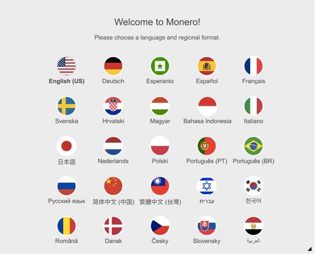                                              

如果您在上方看不到自己的语言，请随时提交翻译以帮助他人！

2 指定一种选项

Monero GUI提供了三种钱包类型选项：主网，测试网和暂存网（stagenet）。

选择主网（默认选项）访问标准的门罗区块链，它使用真实的Monero。测试网和暂存网是两个独立的区块链，开发者们用来开发和代码测试。测试网和暂存网的Monero不具备任何实际货币价值，且不能转移到主网。

若这是您第一个Monero钱包，请点击“创建新钱包”选项。Monero软件将为您生成一个新的种子，且像您显示25个单词的种子助记词。

   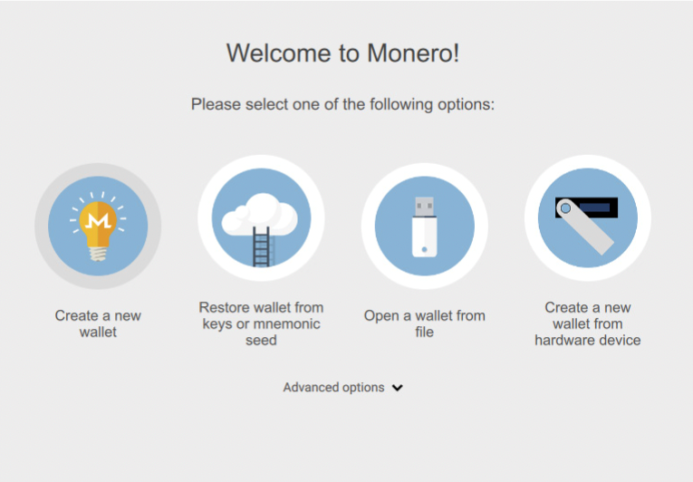

3 记下种子

记住，种子和口令不一样！若您遗失自己的种子，门罗网络无法恢复访问您的资金。请务必把种子记下来并把它存储到安全的地方，任何人都找不到的地方。

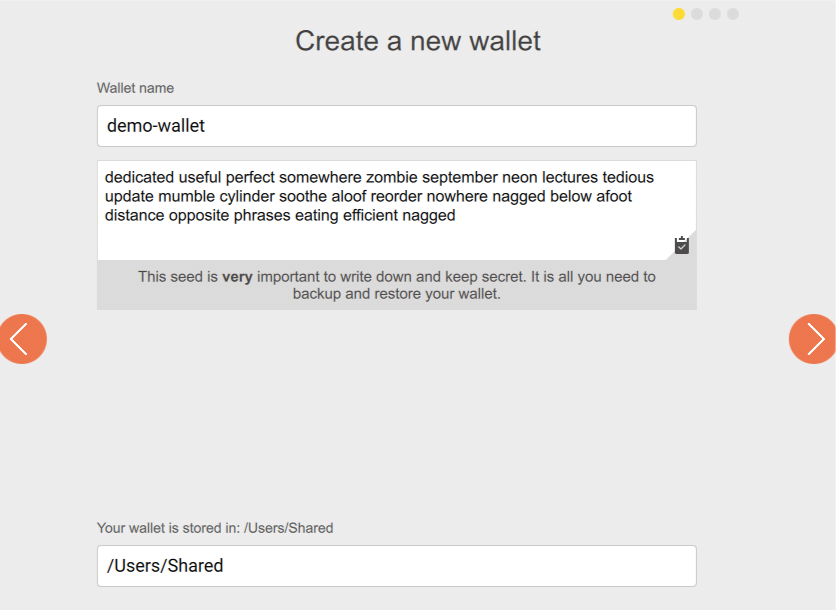

4 输入口令

若有人访问您的计算机，您可以输入钱包口令来确保资金安全。钱包口令是一种本地安全功能，类似PIN屏幕解锁。这不影响密码学或您的moneroj如何存储在区块链上，因此从种子恢复钱包将绕过本地设置的口令。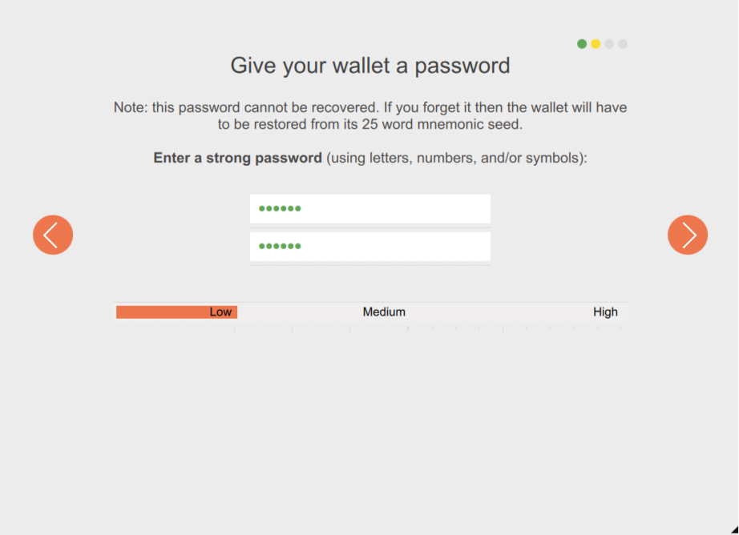  

5下载Monero区块链

接下来，你可以选择启动您的自有节点或连到一个远端节点。

运行自有节点需要至少60GB的磁盘空间来存储区块链。若您的设备资源有限，您可选择“连到一个远程节点”选项来配置一个轻量级钱包，访问存放它处的数据。您可以在4.2.3节的“本地节点” vs “远程节点”了解到更多有关使用远程节点的优缺点。

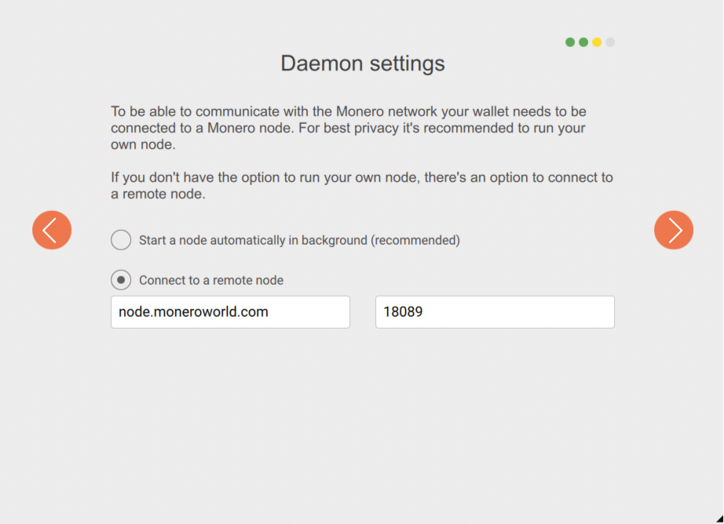

   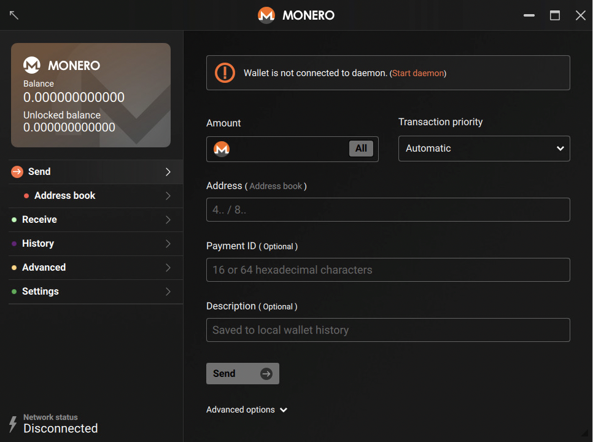

那么 。。。欢迎来到Monero GUI。

### 8.1.2 用GUI接收Monero

Monero GUI的“接收”标签包含接收地址的文本和二维码形式。“创建新地址”按钮生成更多的“子地址”，这都将直接指向相同的钱包（种子）。如果您要收取某人特定数额的Monero，您可以输入“数额”，然后编码为二维码。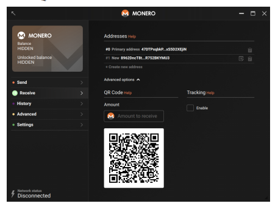 

### 8.1.3 用GUI发送Monero

您要发送门罗币，只需指定要发送的数额以及接收者的地址。除非您的接收者预先指定了付款ID，否则“付款ID”字段可以留为空白。“描述”字段存储在本地，因此您可以自己留下注释。如果您从种子中恢复钱包，这些将无法恢复。

 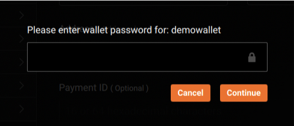

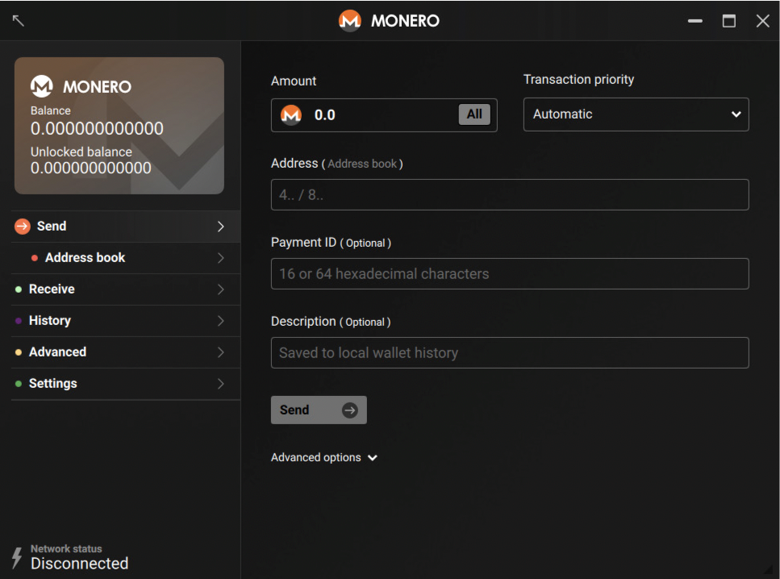

**交易历史** 

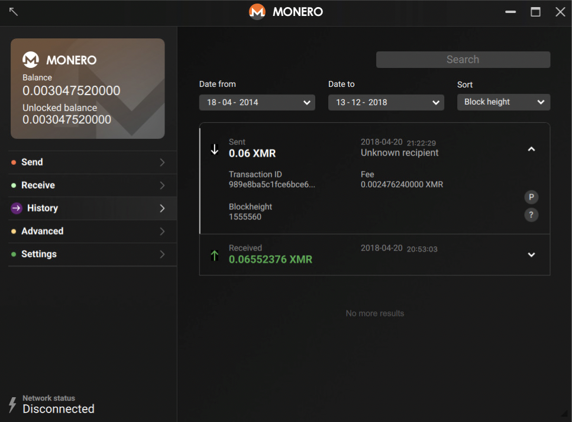

### 8.1.4 GUI的打款证明 

验证打款证明可以通过GUI的“证明/检查”。上面的截图显示了交易ID，地址和来自第2章Maria和Kahn例子的交易密钥。

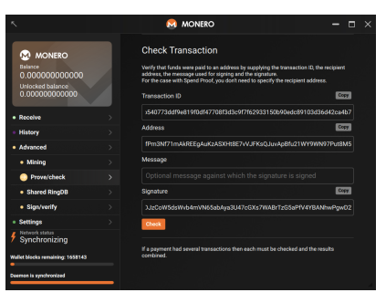

## 8.2  Monero钱包CLI的指令

以下指令显示了如何通过Monero命令行界面（CLI）执行上述的任务。如果您是使用其他钱包，可以跳过本节。

8.2.1 用CLI设置钱包

官方的Monero CLI可以从<https://getmonero.org/downloads>处下载。运行CLI的命令取决您的操作系统。在Linux系统上，从程序文件夹中启动./monero-wallet-cli。您可以添加额外的标记（在本章有记录），若您希望连到一个远程节点，绑定您的IP地址，或其他高级选项。

```
$ wget <https://downloads.getmonero.org/cli/linux64>
2014-08-12 (490 MB/s) - 'li-
nux64' saved [45719102/45719102]
$ tar jxvf linux64
./monero/
./monero/monero-wallet-rpc
./monero/monero-blockchain-import
./monero/monero-blockchain-ancestry
./monero/monero-blockchain-usage
./monero/monero-wallet-cli
./monero/monero-blockchain-depth
./monero/monero-gen-trusted-multisig
./monero/monerod
./monero/monero-blockchain-export
./monero/monero-blockchain-blackball
$ cd monero && ./monero-wallet-cli
2018-10-24 18:58:11,024 INFO  [de-
fault] Page size: 4096
This is the command line monero wallet. It needs
to connect to a monero daemon to work correctly.
WARNING: Do not reuse your Monero keys on another fork, UNLESS this fork has key reuse mitigations built in. Doing so will harm your privacy.
Monero CODENAME (vX.X.X-release)
Specify wallet file name (e.g., MyWallet). If
the wallet doesn't exist, it will be created.
Wallet file name (or Ctrl-C to quit): (enter the
name of your wallet you want to create) testwallet
```

```
No wallet found with that name. Confirm cre-
ation of new wallet named: testwallet
(Y/Yes/N/No): Yes
Generating new wallet...
Enter a new password for the wal-
let: (enter your secret password)
Confirm password: (confirm your password)
List of available languages for your wallet's seed:
0 : Deutsch
1 : English
2 : Español
3 : Français
4 : Italiano
5 : Nederlands
6 : Português
7 : русский язык
8 : Japanese
9 : Chinese
10 : Esperanto
11 : Lojban
Enter the number corresponding to the lan-
guage of your choice: (from 1 to 10)
 
Generated new wallet: 4BKjy1uVRTPiz4pHyaXX-
awb82XpzLiowSDd8rEQJGqvN6AD6kWosLQ6VJX-
W9sghopxXgQSh1RTd54JdvvCRsXiF41xvfeW5
 
View key: 9227a05c665f684f5b8fef815ced-
d8a911b426c9fa07554c70daacf87757b302
**********************************
****************************
Your wallet has been generated!
To start synchronizing with the dae-
mon, use the "refresh" command.
Use the "help" command to see the
list of available commands.
[...]
 
lamb hexagon aces acquire twang bluntly ar-
gue when unafraid awning academy nail threat-
en sailor palace selfish cadets click sickness
juggled border thumbs remedy ridges border
**********************************
****************************
Starting refresh...
Background refresh thread started
[wallet 433bhJ]:
```

### 8.2.2 接收Monero

您输入address会发现您的地址。若您希望将地址与打款ID组合起来，您可以输入integrated_address来生成随机的打款ID，或您可以指定特定的ID作为输入参数，例如：

```
[wallet 433bhJ]: integrated_address 12346780abcdef00
```

您可以使用show_transfers命令回看收到的moneroj。我们可以指定区块高度仅列出最近的交易。例如，只打印自区块650000以来的交易：

```
[wallet 433bhJ]: show_transfers in 650000 
```

### 8.2.3 发送Monero

我们使用transfer命令发送Monero。要发送moneroj到单个地址，您不必指定mixin数（在2018年10月，硬分叉需要固定的11个数）。您需要输入接收者地址及发送的数额。

使用CLI来发送数额为0.6 XMR的交易，命令是：

```
[wallet 433bhJ]:  transfer 4758W1dAkifB2G1wQKmPWRvPs9zdsb5ctRFW2ttQbkQxYHRuPRdHZ9ijqJ7oxcns9SvtpiH8ti8BRjL3LUHaBURpiz4KF  0.06
```

### 8.2.4 打款证明

默认地，CLI不记录交易密钥，但您可以通过set store-tx-info 1来做到这一点。您可以通过指定交易ID作为get_tx_key的首个参数定位到交易密钥。例如：

```
[wallet 433bhJ]: get_tx_key 4b540773ddf9e819f0df47708f3d3c9f7f62933150b90edc8910 3d36d42ca4b7
```

要验证交易密钥，语法是：check_tx_key TXID TXKEY ADDRESS，因此检查Maria的交易密钥（来自第二章的实例）的命令是：

```
[wallet 433bhJ]: check_tx_key
4b540773ddf9e819f0df47708f3d3c9f7f62933150b90edc891 03d36d42ca4b7
```

若您正在寻找一笔付款，您可以用payments命令指定。例如：

```
[wallet 433bhJ]: payments 12346780abcdef00
OutProofV1To53Qu2gegZbUevosKCTwrEdqiECgFyUygutXMEdh
```

## 8.3 排查常见的问题

### 8.3.1 问题：我把monenoj转到了我的钱包，但余额仍为0 XMR。

可用的解决方案：

1）【始终】验证您拷贝的是正确的Monero地址（有时恶意软件可能试图修改拷贝的Monero地址）

2）按这些步骤验证交易是否真实到达您的钱包/地址

A. 前往GUI的设置页面，点击“显示种子和秘钥”。随后，拷贝私有可视密钥。

B. 前往Monero区块链浏览器，例如xmrchain.net。

C. 输入您的交易ID/哈希。

D. 在解码输出栏下输入您的私有可视密钥和地址。

E. 点击解码输出。

F. 若结果显示“输出真”，这证明交易已被发送并记录在Monero区块链。

3）若上述步骤2确认发生了交易，那么您的moneroj在它应该在的地方，但您的钱包还没发现输出。

Monero GUI使用本地缓存，需要花费数秒刷新，尤其在Windows上。若该问题持续存在，尝试点击Monero GUI设置的“再次扫描输出”或尝试通过社区途径寻求支持（见第6章）。

### 8.3.2 问题：我感觉GUI一直有问题/冻结

首先，确保您正在运行最新软件版本，这很重要。您可以在GUI的设置页面检查版本号。若您不是运行最新版本，请首先升级。

GUI在首次同步阶段反应迟钝是正常的。在此过程中，monerod守护进程需要大量的CPU资源来验证区块和交易。

您可以按如下限制monerod的CPU使用：

1. 前往GUI的设置页面。
2. 添加--max-concurrency 1到“守护进程标记”字段
3. 停止守护进程并退出GUI
4. 重启GUI和守护进程

用新标记--max-concurrency重启守护程序是必要的，该标记配置守护进程只利用1个CPU线程。

 