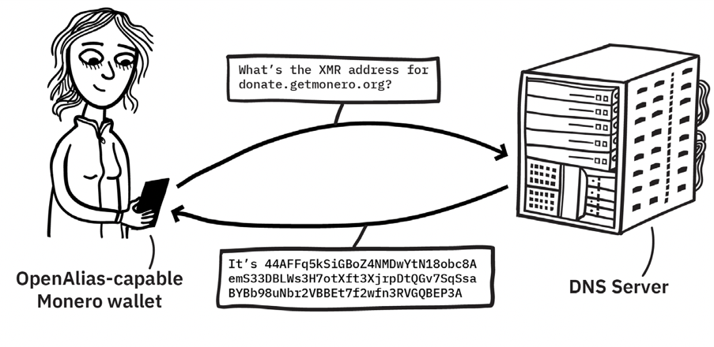

# 7 开发者集成Monero

本章涵盖开发者可用来同Monero交互及构建新工具的标准和协议。首先，我们介绍了OpenAlias和Monero URI格式。它们作为有效的方式来传达地址和其他关键细节。本章其余部分探讨远程过程调用及C++和python语言的集成范例。

## 7.1 OpenAlias:方便的文本地址(适合人类) 

对于没有过目不忘的人来说，记住密码货币地址是非常棘手的。现实生活中的位置，如“123 Main St”或电子邮件地址，例如“[nonceemail@masteringmonero.com](mailto:nonceemail@masteringmonero.com)”比Monero地址（随机Monero地址——CHANGE ME BEFORE RELEASE）更易解释和回忆。

这些密码货币地址包含大量信息，但对人类不友好。事实上，有一个被称为“Zooko三角”的著名三角。它表明设计去中心化，安全和人类有意义的名称系统的困难。上面贴出的Monero地址远不是人类有意义的，但它成功地实现了另外两个标准。

Monero核心团队带着“打破”Zooko三角目的发布了OpenAlias标准来改变名称以便人类可读。Monero公开地址长度至少有95个字符，这很难阅读并且几乎不可能记住。当然有一种简化支付地址的方法。

OpenAlias标准是完全限定域名(FQDN)上的一个文本DNS记录。每个文本记录只需要包含两条信息：前缀和接收方地址。recipient_name键值对也可以添加，但不是必要的。一个典型的OpenAlias文本记录如下：

```
oa1:xmr 
recipient_address =45ttEikQEZWN1m7VxaVN9rjQkpSdmpGZ82Gw Ups66neQ1PqbQMno4wMY8F5jiDt2GoHzCtMwa7PDPJUJYb1GYrMP4C wAwNp
recipient_name=MoneroFFS
```

“oa1:xmr”行表明该记录是基于OpenAlias版本1，并且目的地是一个Monero地址。一个接收者地址是可选指定的，在这种情况下“MoneroFFS”“”每一个字段的完整规范是：

| **名称**                      | **字节大小**     | **描述**                                                     |
| ----------------------------- | ---------------- | ------------------------------------------------------------ |
| oa1                           | 4                | 记录总是以“oa1:”打头，表明它是一个OpenAlias版本1记录。假如我们没有那个前缀，我们就忽略该记录，因为它可能是一个SPF记录或我们不关心的其他东西。 |
| symbol                        | 3                | 密码学货币符号代码。该符号应该遵循ISO   4217规则。例如，对于monero密码货币，货币符号是xmr；对比特币，符号是btc。 |
| recepient_ad-dress=address    | 17+address+1     | 接收方地址。格式是recipent_addr=您的地址，其中您的地址是自己的密码学货币地址。   ，对于Monero，它将是一串数量为95个的字符。多个键值对采用分号分割并且可用于增强可读性的可选空格。键值必须存在。OpenAlias存在给FQDNs取一个任何类型的”地址“的别名，并且这用值表示。 |
| recepient_address=description | 14+description+1 | 这个字段不是必需的，但对确认用户与正确接受者有用，或提供添加一个条目到地址簿的选项给用户有用。 |

OpenAlias标准可以为开发者提供扩展，对用户而言是直观熟悉的，在中心化系统和去中心化系统之间可互操作。该标准可以与任何密码学货币一起使用，并且Monero，Bitcoin(Electrum)和HyperStake已经实现该标准。



图7.1-DNS服务器解析了用户可读的donate.getmonero.org，DNS服务器发回了捐赠地址44AFFq5kSiGBoZ4NMDwYtN18obc8AemS33DBLWs3H7otXft3XjrpDtQGv7SqSsaBYBb98uNbr2VBBet7f2QB。

## 7.2 Monero_URI: 便捷的文本信息（适合计算机）

Monero统一资源标识符标准描述一种格式，为交易清晰传达关键的数据字段。这些URL特别适用于商品促销用途，例如生成支付的QR码（译者注：QR码是二维码的一种）。

Monero的URI语法遵循RFC 3986，且空格必须是x-www-urlencoded编码为%20。下面的URI显示了一个范例，编码了发送给地址4BKq...feW5的0.0413 XMR支付请求，描述是“Mastering Monero book.”。

monero:4BKjy1uVRTPiz4pHyaXXawb82XpzLiowSDd8rEQJGqvN6AD6kWosLQ6VJXW9sghopxXgQSh1RTd54JdvvCRsXiF41xvfeW5?tx_amount=0.0413&tx_description=Mastering%20Monero%20Book

| 参数           | 数据类型 | 描述             |
| -------------- | -------- | ---------------- |
| address        | String   | 原始地址         |
| tx_payment_id  | String   | 交易的支付ID     |
| recipient_name | String   | 接收者的联系名称 |
| tx_amount      | Float    | 交易数额         |
| tx_description | String   | 描述交易         |

使用此QR码向Monero项目发展基金捐赠0.05xmr。

始终检查URL是否为以下内容：：monero:44AFFq5kSiGBoZ4NMDwYtN18obc8AemS33DBLWs3H7otXft3XjrpDtQGv7SqSsaBYBb98uNbr2VBBEt7f2wfn3RVGQBEP3A?tx_amount=0.05&tx_description=Donation%from%Mastering%20Monero%20Book 

## 7.3 Monero RPC 

开发者集成Monero可选用Monero的C++ API(C/C++)或远程过程调用(RPC)接口。RPC方法可被任何编程语言访问，只要它能够创建HTTP请求。因此我们将利用这种灵活性并为一些常见的任务给出范例代码。

对于关键的活动，例如检查余额或发送资金，可通过RPC访问Monero守护进程（monerod）。Monero钱包RPC（monero-wallet-RPC）允许您通过JSON调用管理全部钱包功能。

RPC用“原子单位”表达Monero数额，原子单位是指当前守护进程实现认可的最小门罗币单位。您可以轻易在格式之间转换：

1 XMR = 1x10^12 原子单位

### 7.3.1 初始化和配置 (设置 & 安全)

首先，启动Monero钱包RPC，指定端口及钱包文件位置：

```
$ ./monero-wallet-rpc --rpc-bind-port 18082

--disable-rpc-login --log-level 2 --wallet-file

your-wallet-file --prompt-for-password
```

如果您想使用远程节点，只需添加—daemon-address标记，服务端点地址紧随其后，例如：

```
--daemon-address node.moneroworld.com:18089
 
```

因为monero-wallet-rpc默认不会绑定您的IP地址和端口，您必须指定--rpc-bind-ip yourip来远程连接。

建议一些安全措施，因为开放RPC接口就如同无保护的上safari！ 确保设置用户名和口令在暴露节点之前。如果您遵守这些步骤设置保护，您的API将是安全的。

--restricted-rpc标记在限制RPC权限以避免潜在的滥用是非常有用的。例如，受限模式确保您的节点不会返回隐私敏感数据并防止外部用户在您设备上激活挖矿功能。

### 7.3.2 JSON RPC 格式

JSON-RPC是一种无状态的，轻量级RPC协议，使用JSON RPC 4672数据格式。该规范主要定义了多个数据结构和处理这些结构的规则。该协议是“传输层不可知的“，意味着其功能独立于底层通信机制。因此，同一概念可以应用在给定进程，套接字，或任意其他信道。

为了接收来自钱包RPC的任何信息，您必须用POST方法发送一条信息。JOSN RPC API接收消息格式

```
{ “jsonrpc” : version , “method” :method, “params”: params, “id”: id }
```

使用下面的字段：

| 字段    | **描述**                                   |
| ------- | ------------------------------------------ |
| version | JSON RPC协议版本。Monero钱包RPC支持2.0版本 |
| method  | 声明要调用的功能                           |
| params  | 方法携带的参数。它们可以包含任何其他信息。 |
| id      | 用来追踪应答的数字（从0开始的整数）        |

### 7.3.3 RPC调用范例

Monero的RPC可直接从终端访问，正如以下范例所示。Monero主站托管文档，描述了钱包RPC和守护进程RPC的规范和完整功能。

#### 7.3.3.1 获取余额

钱包的余额可通过getbalance 方法查询到：

```
$ curl -X POST 127.0.0.1:18082/json_rpc -d
'{“jsonrpc”:”2.0”,”id”:”0”,”method”:”getbal-
ance”}' -H 'Content-Type: application/json'
 
```

返回2个输出：balance和unlocked_balance，只包括交易深度足够，被视为安全的（例如，6块确认后可用）

```
{“id”: “0”,“jsonrpc”: “2.0”, “re-
sult”: {  “balance”: 140000000000, “un-
locked_balance”: 84000000000} }
 
```

在这种情况下，钱包包含0.14 XMR，并只有0.084 XMR未解锁。

#### 7.3.3.2 获取地址

查询钱包的地址：

```
$ curl -X POST 127.0.0.1:18082/json_rpc -d
'{“jsonrpc”:”2.0”,”id”:”0”,”method”:”getad-
dress”}' -H 'Content-Type: application/json'
 
```

返回：

```
{“id”: 0,“jsonrpc”: “2.0”,“result”: {“ad-

dress”: “42uMGYwvLuUGJzqdWZvr47CGCBz1qNNEx-

ZeegcjLPMbaFkBb3XG g6Y1bUwaMbovzGWDXtaASxS-

BYtaiBB4wuDmrAMCygexH”, “addresses”: [{

“address”:  “42uMGYwvLuUGJzqdWZvr47CGCBz1qN-

NExZeegcjLPMbaFkBb3XG g6Y1bUwaMbovzGWDXtaASx-

SBYtaiBB4wuDmrAMCygexH”, “address_index”: 0,

“label”: “Primary account”,“used”: false

}, 

{ 
              “address”: “894PaGJyxRjZU8nP-

7Dh4FuAyzr2dK3VT9ZZX95MxdAGP3HoHEpA bNb8Htg-

p5LKzc1pXQ8zhpokTZtcUTnzeU823oUPUGSpv”,

              “address_index”: 1,
               “label”: “”,
              “used”: false
            },                         ] 
      }

}
```

#### 7.3.3.3 创建地址

为一个账户创建1个新地址。可选地，标记新地址。

```
$ curl -X POST 127.0.0.1:18082/json_rpc -d '{“json-rpc”:”2.0”,”id”:”0”,”method”:”create_address”, “params” : “{“account_index:0,”label”:”Secondary account”}}' -H 'Content-Type: application/json' 

{

   “id”: 0, “jsonrpc”: “2.0”, “result”: {
    “address”: “86KoCQsZHQvSUnp9fFn-

92e5QGUiZtH1qZ1nNx1Jv5eJs94ywbLR2k 11CjZ-

Tq5o4v8j9bx3CEAturCheJqJR7cYdQKT4xE3w”,

“address_index”: 9

} 

} 
```

#### 7.3.3.4 创建账户

创建1个账户

```
$ curl -X POST 127.0.0.1:18082/json_rpc -d
'{“jsonrpc”:”2.0”,”id”:”0”,”method”:”cre-
ate_account”,  “params”:{“label”:”Secondary ac-
count”}}' -H 'Content-Type: application/json'
 
```

 

```
{

  “id”: “0”,

  “jsonrpc”: “2.0”,

  “result”: {

    “account_index”: 1,

   “address”: “88bV1uo76AaKZaWD389kCf5Ef-

PxKFYEKUQbs9ZRJm23E2X2oYgV9b Q54FiY-

6hAB83aDXMUSZF6KWyfeQqzLqaAeeFrk9iic”

} 

} 
```

#### 7.3.3.5 转账

转移（发送）Monero数额，指定为原子单位。

```
$ curl -X POST http://127.0.0.1:18082/json_rpc -d

' {“jsonrpc”:”2.0”, ”id”:”0”, ”method”:”transfer”,

”params”:{“destinations”: [{“amount”:100000000,

 ”address”:”9wNgSYy2F9qPZu7KBjvsFgZLTKE2TZgE-

pNFbGka9gA5 zPmAXS35QzzYaLKJRkYTnzgArGNX7T-

vSqZC87tBLwtaC5RQgJ8rm” }, {“amount”:200000000,

 ”address”:”9vH5D7Fv47mbpCpdcthcjU34rqiiAYRCh1tYy-

wmhqnE k9iwCE9yppgNCXAyVHG5qJt2kExa42TuhzQfJbmb-

peGLkVbg8xit” }],”mixin”:4,”get_tx_key”:

true}}' -H 'Content-Type: application/json'

{

  “id”: “0”,

  “jsonrpc”: “2.0”,

  “result”: {

    “fee”: 48958481211,

“tx_hash”: “985180f468637bc6d-

2f72ee054e1e34b8d5097988bb29a2e0cb 763e4464db23c”,

    “tx_key”: “8d62e5637f1fcc9a8904057d6bed-

6c697618507b193e956f77c 31ce662b2ee07”,

    “amount”: 300000000,

    “tx_blob”: “”,

    “tx_metadata”: “”,

    “multisig_txset”: “”

} 

} 
```

## 7.4 Monero集成实践 (Python and C++ 教程)

为这些范例挑选编码语言非常棘手，因为开发者知道没有完美通用的编程语言。但是，Python非常适合本书，因为它是免费和开源的脚本语言，对新手平易近人。 

以下的范例使用最新版，即python 3。大多数基于Debian的Linux发行版预装Python 2和Python 3。在开始之前，您应该更新并升级您的软件以确保必要的资源是最新的：

```
 
$ sudo apt-get update && sudo apt-get -y upgrade                                     
 
```

以下教程的代码在公开仓库中可以免费获取到。您可以通过强大的git版本控制系统直接下载这些练习题：

每个教程位于1个文件夹。例如，“教程1”将是tutorial-1。通过git版本系统下载资源，简单地执行：

```
 
$ git clone https://github.com/monerobook/code                                         
```

### 7.4.1 教程1 – 获取余额

该程序将通过RPC连到守护进程，然后查询和打印账户余额。您可能记得getbalance函数（还对应get_balance）。

我们将从导入2非常有用的Python库开始，“requests”和”json”用于在python中发POST请求。

```
# Mastering Monero Tutorial. This is a comment
import requests
import json
```

让我们预先存储一些信息到变量中，避免弄乱请求：

```
## Import Setup variables
 \## Url for JSON RPC interface. We assume that your RPC interface is running on localhost port 18082
 url = “http://localhost:18082/json_rpc” 

\## JSON headers . Required

headers = {'content-type': 'application/json'}

\## RPC input . Adding method name , at the moment we don't need variables. 

rpc_fields = {

       “method” : “get_balance”

} 
```

回忆一下标准的JSON字段应该被包括在RPC调用中：

\# Adding the JSON RPC version and id. Id is a int variable which should be incremented each request. First request is 0 , second is one and ... rpc_fields.update({“jsonrpc”: “2.0”, “id”: “0”}) 

现在一切准备就绪。因此只剩下一件事要做！使用http POST方法发送全部变量到JSON RPC接口。

```
# execute the rpc request

response = requests.post(url,data=json.dumps(rpc_input),- headers=headers)
 \# print the response as JSON print(json.dumps(response.json())) 
```

保存上述代码为tutorial.py（或您选择的任何名称）并执行：

```
$ python tutorial.py
```

您的脚本应该打印getbalance输出进入终端：

```
{
 “id”: “0”, 

    “jsonrpc”: “2.0”,

    “result”: {

} 

“balance”: 0,

“multisig_import_needed”: false,

“unlocked_balance”: 0 }

}
```

尽管其中包含我们需要的所有信息，输出RPC语法的格式不适合最佳的人工可读性。盯着太多{}会在一段时间后变得头晕眼花！

为了获得更清晰的输出，我们可以在脚本底部添加几行代码，以便只打印余额（或未锁定，如果您愿意）：

```
# Get the balance from response array and convert to a string.
 balance = str(response.json().get('result').get('balance')) 

print(“Balance is “ + balance )
```

现在，运行

```
$ python tutorial.py                                                          
```

应该只返回：

```
  Balance is 426700000                                                             
```

您可以使用像这样的RPC方法来开发自己的个人客户端。

### 7.4.2 教程2 – 如何生成伪随机地址

在第5章，我们介绍了伪随机地址生成的概念。为了增强数学理解，这里是Python实现，供您遵循。

首先，导入必备的库并将它们添加到路径。

```
# Import libraries. Hexlify for hex code, utils for the utility, etc.
 import os, sys
 from binascii import hexlify, unhexlify sys.path.append('../libraries') 

import utils

import ed25519

import base58
```

要开发generate_random_address函数，需要包括几个步骤：

1）通过伪随机地生成一个32字节（256比特）随机数来创建种子。使用hexlify库来把种子转为十六进制编码的字符串，存储在变量seed中。

2）通过将种子减小为ed25519椭圆曲线的有效标量来记录您的秘密花费密钥。 您的秘密花费密钥就是您的种子的这种表示形式。验证需要utils库中的sc_reduce32函数。

3）您的秘密可视密钥计算为秘密花费密钥的减少的哈希值。 hash_to_scalar函数对输入进行哈希处理，然后将其转换为ed25519椭圆曲线的有效标量。

4）通过使用publickey_to_private_key函数将私钥乘以生成点来派生公钥。 您的秘密花费密钥会产生您的公开花费密钥，同样，您的秘密可视密钥也将用于导出您的公开可视密钥。

5）通过连接网络字节（公开Monero地址为0x12），公共花费密钥和公共可视密钥来开始构建公开地址。这些是每个Monero地址中包含的关键信息。

6）通过获取其Keccak-256哈希的前4个字节（8个十六进制字符）添加到上述字符串，计算校验和。

7）通过以Base 58表示形式编码info + checksum以提高可读性。 这里的所有都是它的！ 如第5章所述，Monero地址包括：

[网络字节+公共花费密钥+公共可视密钥+校验和]

```
def generate_random_address():

\## Generate 32 bytes (256 bits) of pseudo-random data 

    seed = hexlify(os.urandom(32))

\## Reduce random data to make it a valid ed25519 scalar 

    secret_spend_key = utils.sc_reduce32(seed)

\## Use a reduced hash of the secret spend key for the deterministic secret view key 

secret_view_key = utils.hash_to_scalar(secret_spend_key) 

\## multiply by the generator point to get public keys from private keys 

public_spend_key = utils.publickey_to_privatekey(se- cret_spend_key) 

public_view_key = utils.publickey_to_privatekey(se- cret_ view_key) 

\## the network byte, public spend key, and public view key are all concatenated together 

    \## 0x12 is the Monero mainnet network byte

    network_byte = “12”

    \## Concatenate the three strings

data = network_byte + public_spend_key + public_view_key hash = utils.keccak_256(data)
 \## checksum is the first 4 bytes (8 hex characters) of 

the hash of the previous data

    checksum = hash[0:8]

    address = base58.encode(data + checksum)

    \## Printing the keys

    print(“Secret_spend_key : “ + secret_spend_key)

    print(“Secret_view_key : “ + secret_view_key)

    print(“Public_spend_key : “ + public_spend_key)

    print(“Public_view_key : “ + public_view_key)

    \## Returning address generated

    return address
```

### 7.4.3 教程3 - 虚荣地址生成器  

虚荣地址是指您需选择生成的具有某些特定前缀的加密货币地址。如果要使用“猫”名称的地址，则可以使用此方法生成以“ 4cat”开头的公开地址。 由于Monero地址格式的原因，这里存在一些限制：您不能删除开头的4（十六进制编码的网络字节，0x12），而基数58的编码不包括某些字符（I，l，0，O）。

您永远不应信任为您生成虚荣加密货币地址的网站或第三方。 因为您无法知道这些密钥是安全生成的，也未被服务或监听保留。

这是一个小的Python脚本，您可以对其进行编码和验证，以安全地生成自己的虚荣地址。 方法很简单：重复生成地址，直到结果之一符合您的条件。 推荐使用短的虚荣字串，因为穷举破解合法地址所需的时间会随着目标字串长度的增加而急剧增加。

大部分代码包含在while（1）中，它将无限循环运行，直到找到匹配的地址为止。 在循环中的每次迭代中，它都会调用上一个示例中的generate_random_address函数来获取新地址。

在创建地址后，脚本将检查前几个字符是否与用户所需的输入匹配。当找到合适的地址后，脚本将打印该地址并退出，从而中断while循环。

```
import sys

sys.path.append('../libraries')

import address

if (len(sys.argv) != 2):
 print(“usage: python vanity_address.py [desired_prefix]”) 

exit() 

if (sys.argv[1][0] != “4”):
 print “Monero addresses must start with the character 4” 

exit() 

\## create random addresses until one of them matches the desired prefix
 \## bruteforcing takes a while
 while(1): 

rand_address = address.generate_random_address()
 if (rand_address[0:len(sys.argv[1])] == sys.argv[1]): 

        print(rand_address)

exit() else: 

        print(“searching”)
```

### 7.4.4 教程4 – 如何创建隐形地址

第5章介绍的隐形地址生成方法有点复杂，所以这里包括了一个Python实现。逐步进行新流程的编码可能非常有助于解释和内化数学。本教程的目标是使用以下方法生成隐身地址：公开视图密钥，公开花费密钥和随机的私有TX密钥（256位标量）。

本教程的目的是使用以下方法生成隐形地址：公共可视密钥，公共花费密钥和随机私有TX密钥（256位标量）。

首先，从文件夹库导入必要的依赖项

```
import os, sys
# library for hex
from binascii import hexlify, unhexlify
sys.path.append('../libraries')
# utils and ed25519 libraries
import utils
import ed25519
```

定义了generate_stealth_address函数，执行必要的数学操作来从公钥和一些随机信息中创建不可链接的地址。

```
def generate_stealth_address(publicViewKey, privateTxKey, publicSpendKey, index): 

\## multiply r*A

derivation = utils.generate_key_derivation(publicViewKey, privateTxKey) 

\## concatenate index to derivation then hash and reduce

\## Hs(rA|i)

scalar = utils.derivation_to_scalar(derivation, index)

\## multiply by base point
 \## Hs(rA|i)G
 sG = ed25519.scalarmultbase(utils.hex2int(scalar))
 \## interpret the public spend key as a point on the curve pubPoint = ed25519.decodepoint(unhexlify(publicSpendKey)) 

\## add the public spend key to the previously calculated point
 \## Hs(rA|i)G + B
 output = ed25519.edwards(pubPoint, sG) 

\## convert the point to a hex encoded public key

return hexlify(ed25519.encodepoint(output))
 

代码可以像这样被调用：

print(generate_stealth_address(“be90718b250a06b4b- cffca6af948240ad6d8951b730a9711f78d4c9decefb4bd”, “12b793b002ed168f36c9dc8d13c0e820546359452f67136f03087e- b18208710e”, “6b48d1c30a640b0b33d0062188df2edd4e6acac- 7282b215e86701a644a9f70ba”, “01”)) 
```

隐形地址不是确定性生成的，因为混入了一些随机数据。一个范例输出看起来像：

```
 
a2bd788a63555e0847800b56051072d-
b3558ac2f97b58b8021e57c67125b4411
 
```

## 7.5 Monero C++ API

通过RPC接口和Monero交互非常简单，而且易于实施，但它也有缺点。您可以生成地址和子地址，甚至转移资金。但是，RPC方法无法有效扩展，并对于大的企业应用可能导致瓶颈问题。

还有其他选择吗？当然！Monero有可以处理所有功能的C++ API，包括管理钱包和发送交易。

C++ API的使用比RPC接口复杂得多，因此您可能不想在生产环境中使用它，除非您对Monero集成非常熟悉。任何错误或问题可能会破坏您的安全性和隐私性。

### 7.5.1 Monero库

Monero核心软件一组多个简单库，有助于Monero活动——例如Boost，Ed2559，和CryptoNight算法。

开发者可以简单从Monero Core库中调用base58_decode。而无需手动从0创建函数。

首先，您必须从Monero Core编译库。编译完成，会输出带.a或.so扩展名的文件。

### 7.5.2 Getting started with C++

要集成Monero Core代码，您必须首先编译它的库。只需要简单遵循上面的指令，并检查第6章的依赖。熟悉C++（具体是C++11标准的基础）将有助于下面的教程。

### 7.5.3 教程5 –从私有花费密钥中恢复全部密钥

本教程显示如何从私有花费密钥中恢复所有的秘钥，使用C++ API和CMake方法。本教程面向Linux平台，因为Apple和Windows实现了它们自己的库（例如，OpenSSL或Boost）。

首先在CMakeLists.txt文件中设置全部的环境变量和库。在本教程中，我们将编译Monero Core到/opt/monero文件夹。

```
cmake_minimum_required(VERSION 3.5)
 set(PROJECT_NAME tutorial-5)
 project(${PROJECT_NAME})
 set(CMAKE_CXX_FLAGS “${CMAKE_CXX_FLAGS} -std=c++11 -ldl”) 

if (NOT MONERO_DIR)
   \# Path of Monero source code
    set(MONERO_DIR ~/monero)

endif()

message(STATUS MONERO_DIR “: ${MONERO_DIR}”)

set(MONERO_SOURCE_DIR ${MONERO_DIR} CACHE PATH “Path to the root directory for Monero”) 

\# set location of Monero build tree

set(MONERO_BUILD_DIR ${MONERO_SOURCE_DIR}/build/Linux/ master/release/ CACHE PATH “Path to the build directory for Monero”) 

set(MY_CMAKE_DIR “${CMAKE_CURRENT_LIST_DIR}/cmake” CACHE PATH “The path to the cmake directory of the current proj- ect”)
 list(APPEND CMAKE_MODULE_PATH “${MY_CMAKE_DIR}”) 

set(CMAKE_LIBRARY_PATH ${CMAKE_LIBRARY_PATH} “${MONERO_ BUILD_DIR}” CACHE PATH “Add Monero directory for library searching”) 

\# find boost 

find_package(Boost COMPONENTS

       system
       filesystem
       thread       
       date_time
       chrono
       regex
       serialization
	   program_options
       date_time
       REQUIRED)

 

\# include boost headers

include_directories(

        ${Boost_INCLUDE_DIRS}

) 

include_directories(

             ${MONERO_SOURCE_DIR}/src

             ${MONERO_SOURCE_DIR}/external

             ${MONERO_SOURCE_DIR}/build

             ${MONERO_SOURCE_DIR}/external/easylogging++

             ${MONERO_SOURCE_DIR}/contrib/epee/include

             ${MONERO_SOURCE_DIR}/version

            ${MONERO_SOURCE_DIR}/external/db_drivers/

liblmdb) 

\# Specify source files

set(SOURCE_FILES main.cpp)

\# Make executable

add_executable(${PROJECT_NAME} ${SOURCE_FILES})

set_target_properties(${PROJECT_NAME} PROPERTIES LINKER_ LANGUAGE CXX) 

set(LIBRARIES

        wallet

        blockchain_db

        cryptonote_core

        cryptonote_protocol

        cryptonote_basic

        daemonizer

       cncrypto

        blocks

        lmdb

        ringct

        device

common

        mnemonics

        epee

        easylogging

        device

        pcsclite

        sodium

        ${Boost_LIBRARIES}

        pthread

        unbound

        crypto

        ringct_basic)

 

if (Xmr_CHECKPOINTS_LIBRARIES)

    set(LIBRARIES ${LIBRARIES} checkpoints)

endif() 

set(LIBS common; blocks; cryptonote_basic; cryptonote_core; cryptonote_protocol; daemonizer; mnemonics; epee; lmdb; device; blockchain_db; ringct; wallet; cncrypto; easylog- ging; version; checkpoints; ringct_basic; ) 

foreach (l ${LIBS})

       string(TOUPPER ${l} L)

       find_library(Xmr_${L}_LIBRARY

                    NAMES ${l}

                    PATHS ${CMAKE_LIBRARY_PATH}

PATH_SUFFIXES “/src/${l}” “/src/ringct” “/src/” “/external/db_drivers/lib${l}” “/lib” “/src/crypto” 

“/contrib/epee/src” “/external/easylogging++/”

                    NO_DEFAULT_PATH

                    )

       set(Xmr_${L}_LIBRARIES ${Xmr_${L}_LIBRARY})

       message(STATUS “ Xmr_${L}_LIBRARIES ${Xmr_${L}_LI-

BRARY}”)

       add_library(${l} STATIC IMPORTED)

set_

property(TARGET ${l} PROPERTY IMPORTED_LOCATION ${Xmr_${L}_ 
```


```
LIBRARIES})
endforeach()
target_link_libraries(${PROJECT_NAME} ${LIBRARIES})
```


现在添加了库，是时候开发我们具体的程序了。从私有花费秘钥中导出所有的秘钥是常见任务，生成或恢复钱包。

```
// main.cpp file for Tutorial 5 - Mastering Monero
 // https://github.com/monerobook/code/tutorial-5/main.cpp 

\#include “cryptonote_core/blockchain.h”

\#include “common/base58.h”

\#include “crypto/crypto-ops.h”

\#include “crypto/hash.h”

// Converts crypto::hash into crypto::secret_key or cryp- to::public_key
 template <typename T>
 T get_key_from_hash(crypto::hash & in_hash){ 

       T* key;

       key = reinterpret_cast<T*>(&in_hash);

       return *key;

} 

int main(){
 // Put here your private spendable key! std::string str_spend_key = “f8f2fba1da00643bbf11f- 

fec355a808d2d8ca4e4de14a10476e116abd8dd7f02”;

// Specify the network type. It could be cryp- tonote::nettype, where nettype is MAINNET, TESTNET or STAGENET 

cryptonote::network_type nettype = cryptonote::- MAINNET; 

       crypto::public_key public_spend_key;

// Convert hex string to binary data

       cryptonote::blobdata blob;

       epee::string_tools::parse_hexstr_to_binbuff(str_

spend_key, blob);

crypto::secret_key sc = *reinterpret_cast<const crypto:: 

secret_key *>(blob.data());
 std::cout << “Private spend key : ” << sc << st- 

d::endl; 

       // Generate public key based on the private key

       crypto::secret_key_to_public_key(sc, public_spend_

key);

std::cout << “Public spend key : “ << public_spend_ key << std::endl; 

       crypto::hash hash_of_private_spend_key;

crypto::cn_fast_hash(&sc, sizeof(), hash_of_pri- vate_spend_key); 

       crypto::secret_key private_view_key;

       crypto::public_key public_view_key;

       // Generate keys from hash_of_private_spend_key

crypto::generate_keys(public_view_key,private_view_ key,get_key_from_hash<crypto::secret_key>(hash_of_private_ spend_key), true); 

std::cout << “\n” << “Private view key : “ << pri- vate_view_key << std::endl; 

std::cout << “Public view key : “ << public_view_key << std::endl; 

cryptonote::account_public_address address {pub- lic_spend_key, public_view_key}; 

std::string public_address;
 // Get account address as a string
 public_address = cryptonote::get_account_address_ 

as_str(nettype, false, address);
 std::cout << “Monero Address:” << public_address << 

std::endl;

       return 0;

} 

```

要编译代码，切到其目录并执行cmake。如果您在教程代码仓库的根目录，执行：

```
$ cd tutorial-5 && cmake .                                                
```

结果应该类似于：

```
$ cd tutorial-5 && cmake .
-- The C compiler identification is GNU 6.3.0
-- The CXX compiler identification is GNU 6.3.0
-- Check for working C compiler: /usr/bin/cc
-- Check for working C compil-
er: /usr/bin/cc -- works
-- Detecting C compiler ABI info
-- Detecting C compiler ABI info - done
-- Detecting C compile features
-- Detecting C compile features - done
.....
-- Configuring done
-- Generating done
-- Build files have been writ-
ten to: /code/tutorial-5
```

```
$ make
Scanning dependencies of target tutorial-5
[ 50%] Building CXX object CMake-
Files/tutorial-5.dir/main.cpp.o
[100%] Linking CXX executable tutorial-5
[100%] Built target tutorial-5
```

如果您遇到任何错误，请首先验证您有CMake（>=v3.5.2）和GCC(>=v5)的正确版本。CMake程序将为您创建一个makefile文件，接着我们只需要调用命令。

最后，通过运行./tutorial-5 来启动程序

```
Private spend key : <f8f2fba1da00643bbf11f-
fec355a808d2d8ca4e4de14a10476e116abd8dd7f02>
Public spend key : <fffb624bd31dfafb015b01c-
beaef28cbff3b2d77af01c54b77d6e1cef04d5f1e>
Private view key : <9227a05c665f684f5b8fef-
815cedd8a911b426c9fa07554c70daacf87757b302>
Public view key : <d79eaf3acfd1f7a93526d2eec-
5bec5b76b880177e2610b69716b4f0577950308>
Monero Address: 4BKjy1uVRTPiz4pHyaXXaw-
b82XpzLiowSDd8rEQJGqvN6AD6kWosLQ6VJX-
W9sghopxXgQSh1RTd54JdvvCRsXiF41xvfeW5
```

 